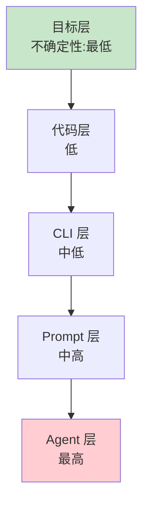

# 第 1 章：AI 浪潮——为什么是现在

> 📍 [学习路径](../../moc/learning-path.md) · [第 0 层](../../moc/layer-0-foundation.md) · 下一章：[第 2 章](chap-02-software-paradigm.md)

## 🍅 番茄钟规划

25min，1 番茄钟：预习 → 正文 → 重点回顾 → 复习题

## 📋 前置回顾

本章是起点，无前置。先问自己：你觉得 AI 是「更好的工具」，还是「不一样的东西」？

## 🔍 预习

如果你觉得 AI 只是「更聪明的搜索」或「更快的打字员」，这章会改变你的看法。一个有十年经验的开发者，从「手动管理 4-6 个 AI 终端」到「24 小时无人值守运行的 Agent 系统」——他的探索路径揭示了一个事实：**AI 正在改变软件本身的样子**。

## 📖 正文

### 1.1 人是瓶颈，但解法不是「替代人」

一个老开发的困境：他同时管 4-6 个 AI 终端，实时盯着每一个输出，做「接受/拒绝」决策。结果是——他成了整个系统的瓶颈。AI 越强，他越累。

直觉的解法是「让 AI 替代人」。但 [[concepts/ai-agent-exploration-path|AI Agent 探索之路]] 给出的答案是反的：

> 解决瓶颈的方式不是让 AI 替代人，而是让**系统不再依赖人的实时在场**。

这是 Agent 时代和「AI 助手」时代的分水岭。前者要造系统，后者只是用工具。

### 1.2 决策层级：能用 Bash 解决的别折腾 AI

[[concepts/ai-agent-exploration-path|探索之路]] 提出决策层级：

**核心原则**：每往上一层，不确定性增加一个量级。**能在下层解决的，绝不上推**。「能用 10 行 Bash 解决的，别折腾 AI」——这不是反 AI，是尊重工程。

### 1.3 Vibe Coding 会崩盘

Vibe coding 前 3 天会让你爽到爆——产出惊人。但 [[concepts/ai-agent-exploration-path|探索之路]] 记录了它的崩盘曲线：

| 阶段 | 状态 |
|---|---|
| Day 1-3 | 产出速度惊人，成就感爆棚 |
| Day 7 | 代码开始乱，陷入"打地鼠" |
| Day 14 | 被迫打开每个文件浏览，大量过度设计 |
| Day 15 | 整整一天"设计与实现对齐" |

> 捷径的尽头是弯路，大道的尽头是自由。

这不是 AI 的问题，是**缺少工程化**的问题。怎么工程化？这正是第 4 层要讲的。

## 🎯 重点回顾

1. **AI 改变的是软件本身**，不是「让旧软件更快」
2. **人是瓶颈**，解法是造系统而非替代人
3. **决策层级**：能在下层解决的别上推，能用 Bash 的别用 AI
4. **Vibe coding 会崩盘**，工程化是必经之路

## 🧠 费曼练习

> 用你自己的话，把「为什么 AI 不是更好的工具」讲给一个 12 岁的孩子听。

提示：别用「范式」「Agent」这种词。用他能懂的话。

## ✅ 复习题

1. **[选择题]** 「人是瓶颈」的解法是？ A. 让 AI 更强 B. 让系统不依赖人的实时在场 C. 多招几个人 D. 慢慢等模型迭代
2. **[问答题]** 决策层级有 5 层，为什么「能在下层解决的别上推」？
3. **[场景题]** 同事要把「检查 git commit message 格式」丢给 AI Agent。建议用哪一层？为什么？
4. **[费曼题]** 用 3 句话向新手解释「为什么 vibe coding 会在 Day 7 崩盘」。
5. **[关联题]** 「决策层级」和「人是瓶颈」有什么内在联系？

??? answer "参考答案"
    1. **B**
    2. 每往上一层不确定性增加一个量级。下层解决更可靠、更便宜、更可调试。
    3. CLI 层。确定性逻辑（git hook 脚本就能做），不需要语义理解。
    4. 前 3 天快是因为任务简单；随着代码量增长，AI 输出多样化，人无法在合理时间内做质量判断，陷入"打地鼠"。
    5. 如果什么任务都上推到 Agent 层，人就要做大量「接受/拒绝」决策，又成了瓶颈。决策层级本质是「分工」。

## 📚 拓展阅读

- [[concepts/ai-agent-exploration-path|AI Agent 探索之路]] — 本章主源
- [[concepts/vibe-coding-paradigm|Vibe Coding 范式]]
- [[concepts/agentic-engineering-paradigm|agentic engineering 工程范式]]
- [[entities/karpathy-vibe-coding-agentic-engineering|Karpathy: 从 vibe coding 到 agentic engineering]]
- [[raw/articles/ai-agent-exploration-path-legacy-tech|Agent 探索之路原文]]

## ⏭️ 下一章预告

第 2 章将讲 **Software 1.0/2.0/3.0**——Karpathy 给这个时代起的正式名字。
