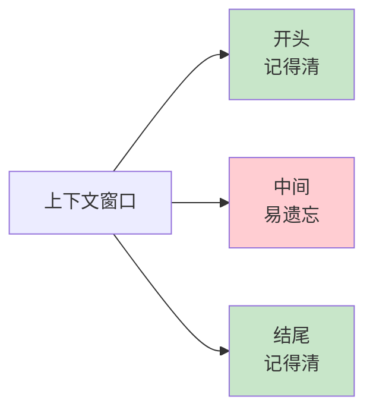

# 第 5 章：Token 与上下文窗口

> 📍 [学习路径](../../moc/learning-path.md) · [第 1 层](../../moc/layer-1-llm-principles.md) · 上一章：[第 4 章](chap-04-transformer.md) · 下一章：[第 6 章](chap-06-training-stages.md)

## 🍅 番茄钟规划

50min，2 番茄钟：番茄1（Token+分词）→ 番茄2（上下文窗口+长上下文+复习题）

## 📋 前置回顾

- 第 2 章：Software 3.0 的「程序」是？
- 第 4 章：attention 的复杂度是？

## 🔍 预习

你用 ChatGPT 时可能遇到过：「对话太长了，前面的忘了」。这不是 bug，是**上下文窗口**的物理限制。这章解释 LLM 怎么把文字切成 token、为什么有长度上限、工程上怎么撑大窗口。

## 📖 正文

### 1.1 Token：LLM 的「字」

LLM 不读文字，读 **token**。[[concepts/llm-tokenizer|LLM Tokenizer]]：英文 1 token ≈ 0.75 个单词，中文 1 个汉字常是 1-2 token。

### 1.2 分词算法：BPE 和 SentencePiece

**BPE**：贪心合并高频字符对。GPT-2 用它。**SentencePiece**：Google 开源，支持 Unigram。LLaMA/Qwen/DeepSeek 用它。分词器决定**词表大小**（3万-15万），影响同样文本占多少 token、多语言能力、代码处理能力。

### 1.3 上下文窗口：LLM 的「工作记忆」

**上下文窗口 = 一次推理能处理的最多 token 数**。GPT-3 是 2K，GPT-4 是 128K，Claude 4 是 200K，Gemini 是 1M+。但长上下文技术提醒：**窗口大 ≠ 全用好**。LLM 在长上下文里会有「中间遗忘」——开头和结尾记得清，中间容易丢。

### 1.4 为什么有上限：O(n²) 的代价

第 4 章说过 attention 是 O(n²)：序列 1K → 100万次计算；10K → 1亿次；100K → 100亿次。而且 **KV-Cache 显存也随长度线性涨**。

### 1.5 撑大窗口的技术

长上下文技术：
- **RoPE 扩展**：旋转位置编码，让模型外推到训练时没见过的长度
- **注意力优化**：FlashAttention 减少 O(n²) 的常数项
- **KV-Cache 优化**：PagedAttention 分页管理显存（第 8 章）
- **长文本 RAG 替代**：用 RAG 只取相关片段（第 12 章）

## 🎯 重点回顾

1. **Token** 是 LLM 处理的最小单位，分词器决定切法
2. **BPE/SentencePiece** 是主流分词算法
3. **上下文窗口** = 一次推理能处理的最大 token 数
4. **O(n²) + KV-Cache 显存** = 窗口不能无限大
5. **中间遗忘现象** → 重要信息放首尾，或用 RAG

## 🧠 费曼练习

> 向 12 岁孩子解释「为什么 AI 聊久了会忘事」。

提示：AI 的记忆像一张桌子，桌子有大小，东西多了旧的会被挤下去。

## ✅ 复习题

1. **[选择题]** 上下文窗口的本质限制来自？ A. 网络带宽 B. attention 的 O(n²) + KV-Cache 显存 C. 分词器词表大小 D. 用户耐心
2. **[问答题]** 同样一句话，中文和英文消耗的 token 数通常哪个更多？为什么？
3. **[场景题]** 要给 LLM 一份 100 页 PDF 总结。直接全文塞进上下文有什么风险？更好的做法？
4. **[费曼题]** 用 3 句话向新手解释「为什么上下文窗口大不代表 LLM 真的记住了全部」。
5. **[关联题]** 回顾第 4 章。上下文从 8K 扩到 32K，head 数不变，单 head 计算量涨几倍？

??? answer "参考答案"
    1. **B**
    2. 中文通常更多。主流分词器词表以英文为主，中文每字常 1-2 token。
    3. 风险：超窗口/中间遗忘/成本高。更好：用 RAG 先检索相关章节。
    4. 窗口大只是「能装下」，不代表「都注意到」。LLM 在长上下文里有中间遗忘。
    5. 单 head 处理的序列长度从 8K 涨到 32K（4 倍），attention 是 O(n²)，所以涨 16 倍。

## 📚 拓展阅读

- [[concepts/llm-tokenizer|LLM Tokenizer]] — BPE/SentencePiece
- 长上下文技术 — RoPE/FlashAttention
- [[entities/accelerate-llm-model-loading-and-increase-context-windows-wi|加速 LLM 加载]]
- [[raw/articles/kimi-attention-residuals-preNorm-dilution-block-attnres|Kimi AttnRes]]

## ⏭️ 下一章预告

第 6 章讲 **训练三阶段**——预训练/SFT/RLHF。
