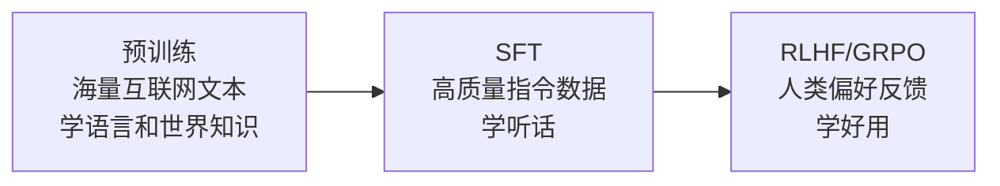

# 第 6 章：训练三阶段

> 📍 [学习路径](../../moc/learning-path.md) · [第 1 层](../../moc/layer-1-llm-principles.md) · 上一章：[第 5 章](chap-05-token-context.md) · 下一章：[第 7 章](chap-07-scaling-laws.md)

## 🍅 番茄钟规划

75min，3 番茄钟：番茄1（预训练）→ 番茄2（SFT+RLHF）→ 番茄3（GRPO+复习题）

## 📋 前置回顾

- 第 4 章：Transformer 的输入是什么？
- 第 5 章：上下文窗口是什么？
- 第 2 章：Software 2.0 的程序是？

## 🔍 预习

你可能听过「GPT 是预训练的」「ChatGPT 用了 RLHF」。这些词到底是什么意思？为什么需要三个阶段？这章把 LLM 从「裸模型」到「听话助手」的全过程讲清。

## 📖 正文

### 1.1 三阶段总览

| 阶段 | 数据 | 学什么 | 产出 |
|---|---|---|---|
| 预训练 | 万亿 token 互联网语料 | 通用语言能力 + 世界知识 | 「会接话」的裸模型 |
| SFT | 万条高质量指令-回答对 | 遵循指令、对话格式 | 「听话」的模型 |
| RLHF | 人类偏好反馈 | 哪个回答更好 | 「好用」的模型 |

### 1.2 预训练：学语言和知识

[[concepts/llm-pretraining-vs-sft|LLM Pretraining vs SFT]]：预训练任务是**下一个 token 预测**。海量这么做，模型学会语法、世界知识、常识推理。但预训练后的模型**不会听话**——你问「写首诗」，它可能接着写「词的格律要求...」。

### 1.3 SFT：学会听话

SFT（监督微调）用**人工标注的指令-回答对**让模型学会遵循指令格式。但 SFT 有个问题：[[concepts/catastrophic-forgetting|灾难性遗忘]]——学新格式时，预训练的某些能力会退化。

### 1.4 RLHF：学好用

RLHF（Reinforcement Learning from Human Feedback）让模型变「好用」：① 模型对同一问题生成多个回答；② 人类标注哪个更好；③ 训练奖励模型学会人类偏好；④ 用强化学习（PPO）让原模型生成更受偏好的回答。

### 1.5 GRPO：2026 年的新演进

RLHF/DPO/GRPO 对齐 三代演进：

| 算法 | 年代 | 特点 |
|---|---|---|
| PPO | 2022 | 经典 RLHF，需奖励模型，工程复杂 |
| DPO | 2023 | 跳过奖励模型，直接从偏好对学，简化工程 |
| GRPO | 2024-2026 | 群体相对策略优化，推理任务效果好 |

GRPO 在 DeepSeek-R1、Qwen 等推理模型上大放异彩——让模型学会「长思考」。

## 🎯 重点回顾

1. **三阶段**：预训练（学语言）→ SFT（学听话）→ RLHF（学好用）
2. **预训练**任务是下一个 token 预测，数据是互联网语料
3. **SFT** 用指令对，但会导致**灾难性遗忘**
4. **RLHF** 用人类偏好，让模型变好用
5. **GRPO** 是 2026 推理模型（R1/o1）的核心算法

## 🧠 费曼练习

> 向 12 岁孩子解释「为什么 ChatGPT 比裸的 GPT 好用」。

提示：裸 GPT 像读完整个图书馆的人（什么都知道但不会聊天），SFT 教它怎么回答问题，RLHF 教它怎么回答得让人满意。

## ✅ 复习题

1. **[选择题]** 预训练的任务是？ A. 学会遵循指令 B. 预测下一个 token C. 模仿人类偏好 D. 学习对话格式
2. **[问答题]** SFT 为什么会导致「灾难性遗忘」？
3. **[场景题]** 训练医疗问答模型，SFT 后发现通用对话能力变差。这是什么问题？怎么缓解？
4. **[费曼题]** 用 3 句话向新手解释 RLHF 在做什么。
5. **[关联题]** 回顾第 2 章 Software 2.0。预训练/SFT/RLHF 各对应 2.0 的哪个环节？

??? answer "参考答案"
    1. **B**
    2. SFT 数据分布和预训练分布有差距。微调时模型为新分布调整权重，旧分布的能力被「覆盖」。
    3. 灾难性遗忘。缓解：① 混合通用数据一起 SFT；② 用 LoRA 等参数高效微调；③ RLHF 阶段加入通用对话偏好。
    4. 让模型对同一问题生成多个回答，人类告诉它哪个更好，模型学会生成更受欢迎的回答。
    5. 预训练 = 训练权重（2.0 核心）；SFT = 微调权重；RLHF = 用偏好数据再调权重。三者都是「改权重」。

## 📚 拓展阅读

- [[concepts/llm-pretraining-vs-sft|LLM Pretraining vs SFT]] — 本章主源
- RLHF/DPO/GRPO 对齐
- [[concepts/catastrophic-forgetting|灾难性遗忘]]
- Fine-tuning 技术
- [[entities/llm-post-training-full-guide|LLM Post-Training 全景指南]]
- [[entities/aws-grpo-rlvr-sagemaker-math-reasoning|GRPO+RLVR]]
- [[raw/articles/building-blocks-for-foundation-model-training-and-inference-on-aws|AWS 基础模型训练]]

## ⏭️ 下一章预告

第 7 章讲 **Scaling Law**——为什么模型越大效果越好。
