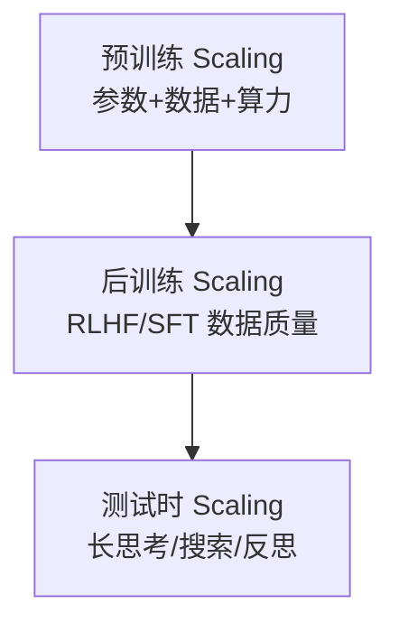

# 第 7 章：Scaling Law

> 📍 [学习路径](../../moc/learning-path.md) · [第 1 层](../../moc/layer-1-llm-principles.md) · 上一章：[第 6 章](chap-06-training-stages.md) · 下一章：[第 8 章](chap-08-inference-optimization.md)

## 🍅 番茄钟规划

25min，1 番茄钟：预习 → 正文 → 重点回顾 → 复习题

## 📋 前置回顾

- 第 6 章：预训练的任务是？
- 第 6 章：三阶段是什么？

## 🔍 预习

你可能听过「GPT-3 有 1750 亿参数」「Llama 3 训了 15 万亿 token」。为什么大家都拼命把模型做大？这不是盲目攀比，是有数学规律的——**Scaling Law**。

## 📖 正文

### 1.1 Kaplan Scaling Law（2020）

[[concepts/scaling-laws|Scaling Laws]] 记录 OpenAI 2020 年的发现：
```
L(N) ∝ N^(-0.076)    模型越大，loss 降越快
L(D) ∝ D^(-0.095)    数据越多，效果越好
L(C) ∝ C^(-0.050)    算力越多，loss 按幂律降
```
**三者都翻倍，loss 都会降**。催生了 GPT-3 (175B)、PaLM (540B) 等超大模型。

### 1.2 Chinchilla 修正（2022）

DeepMind 2022 年的 Chinchilla：**模型和数据应等比例扩展**（N ∝ D^0.54）。结论：**GPT-3 这种大模型小数据是次优的**。同等算力下，应该训更小的模型、用更多数据。这就是为什么 Llama 系列走「小模型 + 多数据」路线。

### 1.3 三重扩展 Regimes

[[concepts/scaling-laws|Scaling Laws]] 指出 2026 年的 scaling 是**三重 regimes**：



### 1.4 边界：Scaling 不是万能

- **数据质量 > 数量**：Llama 3 的 .repeat() 过采样导致记忆而非泛化
- **数据稀缺**：高质量互联网文本快用完了，合成数据成新方向
- **边际递减**：从 7B→70B 提升明显，从 405B→1T 提升变小

## 🎯 重点回顾

1. **Kaplan Law**：参数/数据/算力都翻倍，loss 都降
2. **Chinchilla 修正**：参数和数据应等比例，小模型+多数据更优
3. **三重 regimes**：预训练 + 后训练 + 测试时
4. **边界**：数据质量 > 数量；高质量数据快耗尽；边际递减

## 🧠 费曼练习

> 向 12 岁孩子解释「为什么 AI 公司拼命把模型做大」。

提示：像做菜，食材（数据）和厨师手艺（参数）都要够。

## ✅ 复习题

1. **[选择题]** Chinchilla 对 Kaplan Law 的核心修正是？ A. 模型越大越好 B. 参数和数据应等比例扩展 C. 算力不重要 D. 数据越多越好
2. **[问答题]** 为什么 Llama 3 用 15T tokens 训 405B 模型，远超 Chinchilla 最优比例？
3. **[场景题]** 只有 100 万美元算力预算训一个中文 LLM。怎么分配参数和数据？
4. **[费曼题]** 用 3 句话向新手解释「三重扩展 regimes」。
5. **[关联题]** 回顾第 6 章训练三阶段。三重 scaling regimes 和三阶段训练有什么对应关系？

??? answer "参考答案"
    1. **B**
    2. Llama 3 团队发现：在高质量 web data 上，超过 Chinchilla 最优点继续训仍能提升。
    3. 按 Chinchilla：参数和数据等比例。宁可训小模型（如 7B）+ 用足够多高质量中文数据。
    4. 三个地方投算力都能涨性能：预训练投模型和数据；后训练投 RLHF 质量；测试时投长思考。
    5. 预训练 scaling ↔ 预训练阶段；后训练 scaling ↔ SFT/RLHF；测试时 scaling ↔ 推理时的长思考。

## 📚 拓展阅读

- [[concepts/scaling-laws|Scaling Laws]] — 本章主源
- 合成数据生成
- Reasoning Models
- [[entities/kimi-attention-residuals-prenorm-dilution-block-attnres|Kimi AttnRes]]
- [[raw/articles/building-blocks-for-foundation-model-training-and-inference-on-aws|AWS 基础模型训练]]

## ⏭️ 下一章预告

第 8 章讲 **推理优化**——部署时怎么省显存、加速。
