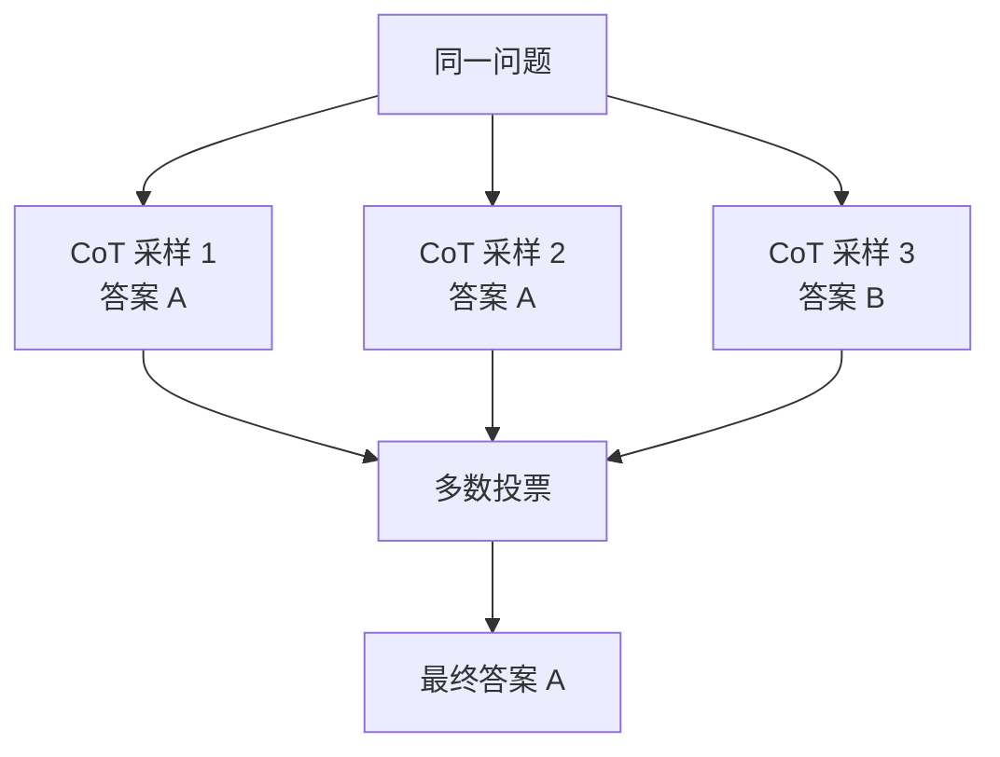

# 第 10 章：Prompt 模式

> 📍 [学习路径](../../moc/learning-path.md) · [第 2 层](../../moc/layer-2-interaction.md) · 上一章：[第 9 章](chap-09-prompt-fundamentals.md) · 下一章：[第 11 章](chap-11-context-engineering.md)

## 🍅 番茄钟规划

50min，2 番茄钟：番茄1（Zero-shot/Few-shot/CoT）→ 番茄2（自一致性+编排+复习题）

## 📋 前置回顾

- 第 9 章：Prompt 四组件是什么？
- 第 9 章：为什么正向指令比否定好？
- 第 4 章：模型怎么 attention 到 Prompt 里的内容？

## 🔍 预习

第 9 章你学了「怎么写清楚指令」。但有些任务光写清楚不够——比如数学题、逻辑推理、按特定格式输出。这时候需要**模式技巧**：Few-shot 示范、CoT 思维链、自一致性投票。

## 📖 正文

### 1.1 Zero-shot vs Few-shot

Prompt 工程模式 区分两种基本模式：

**Zero-shot**：不给示例，直接下指令。
```
把以下句子分类为正面/负面/中性：
"这部电影还行"
```

**Few-shot**：给几个示例，让模型学规律。
```
示例：
"画面太美了" → 正面
"浪费时间" → 负面
"还行吧" → 中性

现在分类："这部电影还行"
```

Few-shot 让模型从示例**归纳**模式，对格式要求严的任务特别有效。

### 1.2 Chain-of-Thought (CoT)

CoT 让模型**显式写出推理过程**，而不是直接给答案。

```
差（直接答）：
Q: 小明有 5 个苹果，吃了 2 个，又买了 3 个，剩几个？
A: 6 个

好（CoT）：
Q: 同上
A: 让我一步步算。开始有 5 个，吃了 2 个剩 3 个（5-2=3），又买了 3 个变成 6 个（3+3=6）。答案是 6 个。
```

CoT 的原理：模型生成每个 token 时，前面的 token 会成为后续生成的 context。**显式写推理 = 给自己提供中间 context**，让后续计算更准。经典触发词：「Let's think step by step」。

### 1.3 什么时候用 CoT

| 任务 | 用 CoT？ |
|---|---|
| 翻译 | ❌ 不需要 |
| 总结 | ❌ 直接总结 |
| 数学题 | ✅ 必须 |
| 逻辑推理 | ✅ 必须 |
| 代码 debug | ✅ 有帮助 |
| 多步决策 | ✅ 必须 |

**原则**：需要中间推理的用 CoT，直接映射的别用（浪费 token 还可能引入噪音）。

### 1.4 自一致性（Self-Consistency）

CoT 有时推理路径会错。**自一致性**是多次采样取多数：



代价是推理成本翻 N 倍，但对高价值任务（如数学竞赛）值得。

### 1.5 Prompt 编排：分阶段

复杂任务不要一个 Prompt 搞定，**拆成多阶段**：
```
阶段 1：信息抽取 Prompt → 得到结构化数据
阶段 2：分析 Prompt → 基于结构化数据分析
阶段 3：报告生成 Prompt → 把分析转成报告
```

每个阶段输出作为下阶段输入。这是 Agent 的雏形（第 3 层详讲）。

## 🎯 重点回顾

1. **Zero-shot** 不给示例，**Few-shot** 给示例让模型归纳
2. **CoT** 让模型显式推理，适合数学/逻辑
3. **CoT 原理**：中间 token 成为后续 context
4. **自一致性** 多次采样取多数，提精度但增成本
5. **Prompt 编排** 拆多阶段，是 Agent 雏形

## 🧠 费曼练习

> 向 12 岁孩子解释「为什么让 AI 写出思考过程，答案会更准」。

提示：做数学题，心算容易错，写草稿能一步步检查。

## ✅ 复习题

1. **[选择题]** CoT 对哪类任务帮助最大？ A. 翻译 B. 文本分类 C. 多步数学推理 D. 改写润色
2. **[问答题]** 解释 CoT 为什么有效（从 attention 角度）。
3. **[场景题]** 让 LLM 从合同抽取「甲方/乙方/金额/期限」。用 Few-shot 设计，给 2 个示例。
4. **[费曼题]** 用 3 句话向新手解释「自一致性」。
5. **[关联题]** 回顾第 9 章「分步骤」。第 9 章的分步骤和本章的 CoT 有什么联系和区别？

??? answer "参考答案"
    1. **C**
    2. 模型生成是逐 token 的，每个 token 生成时 attention 到前面所有 token。显式写推理 = 把推理步骤作为 token 写出来，后续步骤能 attention 到这些中间结论。
    3. 示例1：「甲方ABC，乙方XYZ，金额10万，期限1年」→ 甲方:ABC;乙方:XYZ;金额:10万;期限:1年。示例2类似。然后给新合同让模型抽取。
    4. 同一问题让 AI 算多次，每次可能走不同推理路径，最后看哪个答案出现最多就选哪个。
    5. 联系：都是把复杂任务拆成步骤。区别：第9章是给模型一个清单让它逐项做（外部结构）；CoT 是让模型自己写出推理过程（内部展开）。

## 📚 拓展阅读

- Prompt 工程模式 — 本章主源
- Reasoning Models — 内置 CoT 的模型（o1/R1）
- [[concepts/tool-use-reasoning|工具使用推理]] — 第 15 章主讲
- [[entities/harness-engineering-core-patterns-claude-code|Harness 核心模式]]
- [[entities/tencent-skill-writing-complete-playbook-jackjchou|腾讯 Skill 写作 Playbook]]

## ⏭️ 下一章预告

第 11 章讲 **上下文工程**——从「写好一条 Prompt」到「管理整个信息供给」。
