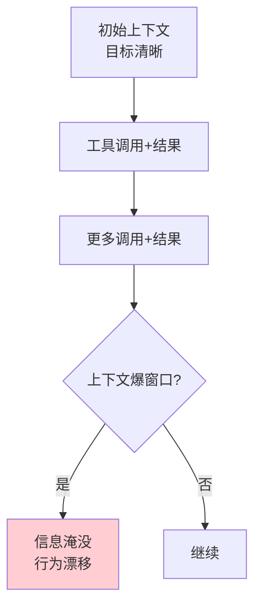
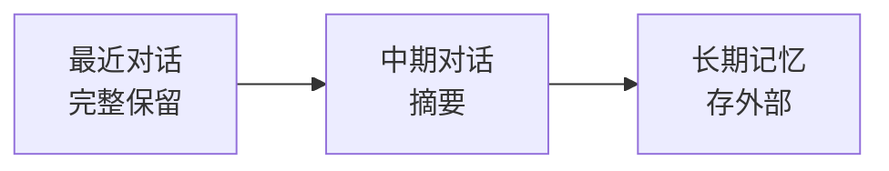

# 第 11 章：上下文工程

> 📍 [学习路径](../../moc/learning-path.md) · [第 2 层](../../moc/layer-2-interaction.md) · 上一章：[第 10 章](chap-10-prompt-patterns.md) · 下一章：[第 12 章](chap-12-rag.md)

## 🍅 番茄钟规划

50min，2 番茄钟：番茄1（从 Prompt 到 Context）→ 番茄2（四策略+Prompt Caching+复习题）

## 📋 前置回顾

- 第 5 章：上下文窗口的本质限制是？（O(n²) + KV-Cache 显存）
- 第 9 章：Prompt 四组件？
- 第 10 章：CoT 为什么有效？（中间 token 成为后续 context）

## 🔍 预习

第 9、10 章你学的是「写好一条 Prompt」。但真实场景里，LLM 不是一条一条用——Agent 会持续对话、工具会返回大量结果、记忆会累积。这时候问题从「怎么说清楚」变成「**给什么看**」——这就是**上下文工程**。Anthropic 的 Thariq 在 2025 系统化了这个概念。

## 📖 正文

### 1.1 从 Prompt Engineering 到 Context Engineering

[[concepts/context-engineering|上下文工程]] 给出关键区分：

| 维度 | Prompt Engineering | Context Engineering |
|---|---|---|
| 核心问题 | 模型听得懂吗？ | 模型拿到足够且正确的信息吗？ |
| 优化重心 | 怎么说 | 给什么看 |
| 范围 | 单次交互 | 整个信息供给系统 |

### 1.2 为什么 Agent 时代需要它

第 1 章讲过「vibe coding 会崩盘」。崩盘的根因之一：**上下文失控**。Agent 跑久了，上下文里堆满历史对话、工具返回结果、中间推理、错误信息。如果不管理，上下文会爆窗口、会噪音淹没信号、会让模型「忘了最初目标」。

### 1.3 四大策略：进/压/存/弃

| 策略 | 做什么 | 例子 |
|---|---|---|
| **进** | 哪些信息该进窗口 | 只加载相关工具结果 |
| **压** | 冗长信息压缩 | 对话历史摘要 |
| **存** | 暂时不用的存外部 | 写到文件/记忆系统 |
| **弃** | 无关信息直接丢 | debug 日志只留关键行 |

核心思想：**不是塞更多信息进窗口，而是在约束下做最优信息供给**。

### 1.4 Prompt Caching：省成本不是省上下文

[[concepts/context-engineering|上下文工程]] 提到 Anthropic 的 Prompt Caching：
- 系统 Prompt 不变 → 缓存其 KV
- 下次请求只算新增部分
- **省的是计算成本，不是上下文内容**

但要注意：缓存命中要求前缀完全一致，改一个字就失效。所以系统 Prompt 要稳定，动态信息放后面。

### 1.5 上下文压缩：长对话的处理

对话长了怎么办？三种做法：
1. **滑窗**：只保留最近 N 轮，旧的直接丢
2. **摘要**：把旧对话压缩成一段总结
3. **分层记忆**：最近详细 + 中期摘要 + 长期存外部（第 14 章 Agent 记忆详讲）

## 🎯 重点回顾

1. **Context Engineering** 关注「给什么看」，比 Prompt Engineering 更上层
2. **Agent 时代需要它**——上下文会爆、会噪音淹没信号
3. **四大策略**：进/压/存/弃
4. **Prompt Caching** 省成本不省内容，前缀需稳定
5. **长对话处理**：滑窗/摘要/分层记忆

## 🧠 费曼练习

> 向 12 岁孩子解释「为什么 AI 聊久了要主动总结前面的话」。

提示：像读书做笔记，看到后面忘了前面就翻回去太累，不如中途记个摘要。

## ✅ 复习题

1. **[选择题]** Context Engineering 和 Prompt Engineering 的核心区别？ A. 前者用英文后者用中文 B. 前者管「给什么看」后者管「怎么说」 C. 前者是技术后者是艺术 D. 没区别
2. **[问答题]** 上下文工程的四大策略是什么？各举一个例子。
3. **[场景题]** Agent 跑了 1 小时，工具调用了 50 次，现在开始「忘了」最初目标。用四大策略怎么救？
4. **[费曼题]** 用 3 句话向新手解释「为什么 Prompt Caching 不能缓存动态内容」。
5. **[关联题]** 回顾第 5 章 + 第 10 章 CoT。CoT 生成的中间推理会占上下文，这和上下文工程的「压」策略有什么张力？

??? answer "参考答案"
    1. **B**
    2. 进：只加载相关信息；压：长内容压缩成摘要；存：暂不用信息存外部文件；弃：无关信息直接丢。
    3. 诊断：上下文堆积导致信号淹没。处理：①「弃」掉无关工具结果；②「压」把前面对话摘要；③「存」中间产物到文件；④ 重新加载目标和关键状态到上下文开头。
    4. Prompt Caching 要求前缀完全一致才命中。动态内容每次不同，放前面会让后面所有缓存失效。所以动态信息要放系统 Prompt 之后。
    5. 张力：CoT 要把推理写出来（占上下文）才能提升准确率，但上下文工程要压缩减少占用。解法：用分层——最近几步 CoT 保留，早期 CoT 压缩成结论，超长的存外部。这就是 Agent 记忆系统要解决的（第 14 章）。

## 📚 拓展阅读

- [[concepts/context-engineering|上下文工程]] — 本章主源
- [[concepts/context-management-agent-systems|Agent 上下文管理]]
- [[concepts/harness-context-window-management|Harness 上下文窗口管理]]
- [[entities/claude-code-context-engineering-anthropic-thariq|Anthropic 上下文工程]]
- [[entities/anthropic-prompt-caching-claude-code|Prompt Caching 九原则]]
- [[raw/articles/claude-code-prompt-context-harness|Claude Code 上下文 Harness]]

## ⏭️ 下一章预告

第 12 章讲 **RAG 检索增强**——当模型参数记忆不够，怎么用外部知识库补充。
