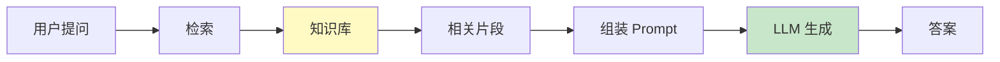
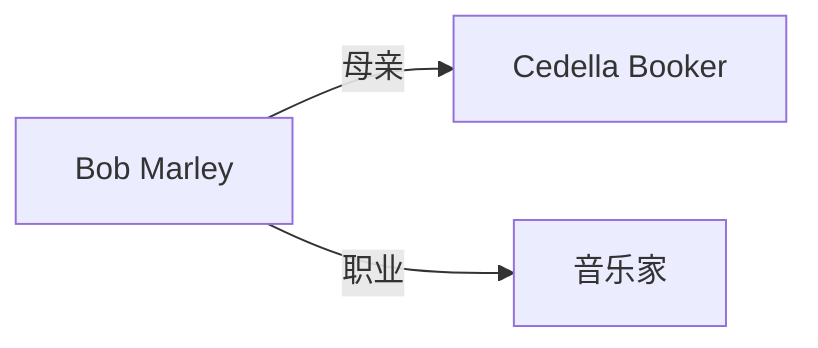

# 第 12 章：RAG 检索增强生成

> 📍 [学习路径](../../moc/learning-path.md) · [第 2 层](../../moc/layer-2-interaction.md) · 上一章：[第 11 章](chap-11-context-engineering.md) · 下一层：[第 3 层](../../moc/layer-3-agent-engineering.md)

## 🍅 番茄钟规划

75min，3 番茄钟：番茄1（RAG 是什么+基本流程）→ 番茄2（向量检索+chunk/rerank）→ 番茄3（知识图谱+Agentic RAG+关卡）

## 📋 前置回顾

- 第 5 章：长文档塞进上下文有什么风险？（中间遗忘 + 成本）
- 第 11 章：上下文工程「存」策略指什么？
- 第 3 章：LLM Wiki 和 RAG 的本质区别是什么？

## 🔍 预习

LLM 的知识来自训练数据——GPT-4 训练截止 2023，问它「2026 年新事件」它不知道或瞎编（幻觉）。RAG（Retrieval-Augmented Generation）的思路：**别让模型靠参数记忆，让它在生成前先查外部知识库**。这是企业落地 LLM 最常用的架构。

## 📖 正文

### 1.1 RAG 是什么

[[concepts/retrieval-augmented-generation-rag|RAG]] = Retrieval（检索）+ Augmentation（增强）+ Generation（生成）。

流程：用户提问 → 从知识库检索相关片段 → 把片段塞进 Prompt → LLM 基于片段生成答案。

### 1.2 为什么不直接塞全文

第 5 章讲过：长文档塞进上下文有三大问题：超窗口/中间遗忘/成本高。RAG 只取**相关片段**进上下文，绕过这三个问题。

### 1.3 向量检索：语义匹配

向量搜索与嵌入 原理：
1. 把所有文档切块（chunk）
2. 每个 chunk 用 embedding 模型转成向量
3. 用户问题也转成向量
4. 算问题向量和所有 chunk 向量的相似度（如余弦）
5. 取最相似的 N 个 chunk

### 1.4 Chunk 策略和 Rerank

**Chunk**：文档怎么切？切太大丢精度，切太小丢上下文。常见策略：固定长度（如 500 token）/按段落标题切/重叠切（chunk 间重叠 50 token 保上下文连续）。

**Rerank**：向量检索粗筛 Top-50，再用更精的模型（如 cross-encoder）重排取 Top-5。粗筛快、精排准，兼顾速度和精度。

### 1.5 向量 RAG 的局限

[[concepts/retrieval-augmented-generation-rag|RAG]] 指出向量库的缺陷：**把知识压成孤立的语义点**，丢失了关系。例：问「Bob Marley 的母亲是谁」。向量检索找到相关文本，但模型可能混淆——因为向量只存语义相似，不存「母亲」这种关系。

### 1.6 知识图谱 RAG

知识图谱 RAG 用图代替向量：
- 节点是实体（人/物/概念）
- 边是关系（母亲-of、作者-of）

检索时沿关系走，能回答需要关系推理的问题。

### 1.7 Agentic RAG：Agent 时代的演进

Agentic RAG 模式：与其让 RAG 一次检索，让 **Agent 决定要不要查、查什么、查几次**。模型先判断「这个问题需要查资料吗」，查一次不够自主决定再查，评估检索结果质量，不够就换个查询。这是 RAG 从「工具」到「Agent 能力」的进化。

## 🎯 重点回顾

1. **RAG** = 检索 + 增强 + 生成，绕过上下文窗口限制
2. **向量检索** 用 embedding 算语义相似度
3. **Chunk 策略** 影响精度，**Rerank** 兼顾速度和准度
4. **向量 RAG 局限**：丢失关系 → 知识图谱 RAG 补
5. **Agentic RAG**：Agent 自主决定查不查、查几次

## 🧠 费曼练习

> 向 12 岁孩子解释「RAG 和人查资料的区别」。

提示：RAG 像 AI 考试时允许翻书，但翻哪页要它自己判断。

## ✅ 复习题

1. **[选择题]** RAG 解决的核心问题是？ A. 模型不够大 B. 模型参数知识不够/过时 C. 推理太慢 D. 上下文窗口太大
2. **[问答题]** 描述 RAG 的基本流程（5 步）。
3. **[场景题]** RAG 系统检索准确率低。从 chunk、embedding、rerank 三方面给优化方向。
4. **[费曼题]** 用 3 句话向新手解释「向量检索在做什么」。
5. **[关联题]** 回顾第 3 章 LLM Wiki。LLM Wiki 和 RAG 都用外部知识，本质区别是什么？

??? answer "参考答案"
    1. **B**
    2. ① 用户提问 → ② 向量检索相关 chunk → ③（可选 rerank）→ ④ 组装进 Prompt → ⑤ LLM 基于片段生成。
    3. Chunk：按段落切+重叠；Embedding：换更好的模型或领域微调；Rerank：加 cross-encoder 精排 Top-5。
    4. 把所有文档和用户问题都转成数字向量，算哪个文档向量离问题最近，就取那个——本质是「语义距离排序」。
    5. RAG 每次临时检索，知识停留「能被检索到」，没有结构化关联；LLM Wiki 是 AI 持续维护的结构化笔记，有 wikilink 互链，知识会进化、有网络效应。

## 📚 拓展阅读

- [[concepts/retrieval-augmented-generation-rag|RAG]] — 本章主源
- 向量搜索与嵌入
- 知识图谱 RAG
- Agentic RAG 模式
- [[entities/rag-chunk-embedding-rerank-pipeline|RAG Pipeline]]
- [[entities/gemini-embedding-2-multimodal-unified-vector-hyman|Gemini Embedding 2]]
- [[raw/articles/向量库是rag的前菜知识图谱是答案本体论是灵魂|向量库是 RAG 的前菜]]

## 🚪 第 2 层关卡

恭喜完成第 2 层！回答 [第 2 层 MOC](../../moc/layer-2-interaction.md) 的 5 道关卡题。

## ⏭️ 下一层预告

第 3 层讲 **Agent 工程**——从对话到 Agent。学完「怎么用 LLM」，第 3 层给你「怎么让 LLM 自主行动」。
