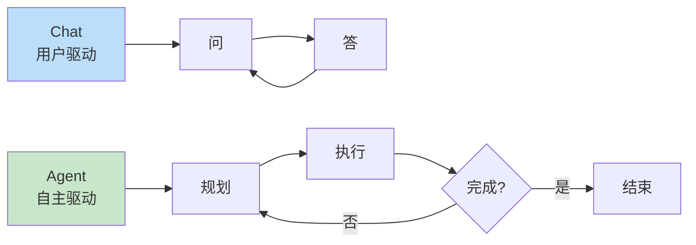
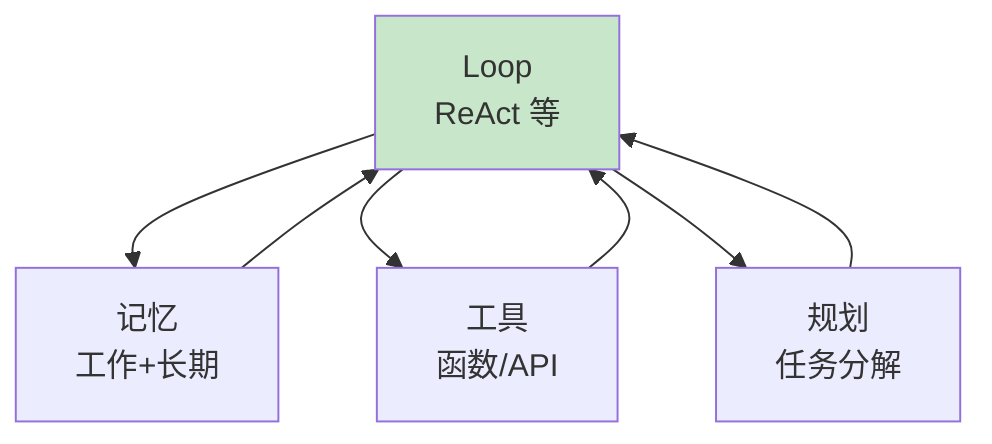

# 第 13 章：从对话到 Agent

> 📍 [学习路径](../../moc/learning-path.md) · [第 3 层](../../moc/layer-3-agent-engineering.md) · 上一章：[第 12 章](chap-12-rag.md) · 下一章：[第 14 章](chap-14-agent-memory.md)

## 🍅 番茄钟规划

50min，2 番茄钟：番茄1（Agent 定义+与 Chat 区别）→ 番茄2（Agent Loop+核心组件+复习题）

## 📋 前置回顾

- 第 10 章：Prompt 编排是什么？（拆多阶段，Agent 雏形）
- 第 11 章：Context Engineering 管什么？（给什么看）
- 第 12 章：RAG 让 LLM 做什么？（生成前先查资料）

## 🔍 预习

前面 12 章你学的是「怎么用好 LLM」——但它仍是你发指令它执行的工具。这一章跨越到 **Agent**：LLM 自己决定下一步做什么、调用什么工具、什么时候停。这是从「用工具」到「造能自主用工具的系统」。

## 📖 正文

### 1.1 Agent 是什么

[[concepts/ai-agent-patterns|AI Agent Patterns]] 定义：Agent 是能**自主决策、执行任务、与环境交互**的智能系统。三个关键词：**自主**（自己决定下一步）/ **执行**（能调用工具、改环境）/ **交互**（能感知环境反馈，调整行为）。

### 1.2 Chat vs Agent

| 维度 | Chat（ChatGPT） | Agent |
|---|---|---|
| 交互模式 | 一问一答 | 自主多步 |
| 控制权 | 用户驱动 | Agent 驱动 |
| 状态 | 单轮或对话历史 | 持续任务状态 |
| 工具 | 用户手动用 | Agent 自主调用 |
| 终止 | 用户说停 | Agent 判断完成 |

### 1.3 Agent Loop：核心运行机制

Agent 循环设计 几种主流循环：

**ReAct**（Reason + Act）：`思考 → 行动 → 观察 → 思考 → 行动 → ... → 完成`

**Plan-Execute**：`规划全部步骤 → 逐步执行 → 必要时重规划`

**Reflexion**：`执行 → 反思结果 → 改进 → 重试`

ReAct 最常用——每步都思考下一步，灵活但慢；Plan-Execute 先规划再执行，快但刚硬。

### 1.4 Agent 的核心组件

一个完整 Agent 通常有四件套：

- **Loop**：运行骨架（第 13 章）
- **记忆**：怎么存历史（第 14 章）
- **工具**：怎么动手（第 16 章）
- **规划**：怎么分解任务（第 15 章）

### 1.5 从 Task-Driven 到 Goal-Driven

[[concepts/ai-agent-patterns|AI Agent Patterns]] 记录 Agent 演进：

| 阶段 | 模式 | 例子 |
|---|---|---|
| Task-Driven | 用户给每步任务 | 「先搜索再总结」 |
| Goal-Driven | 用户给目标，Agent 自己分解 | 「帮我了解 X」 |

Goal-Driven 是 Agent 的成熟形态——这正是第 1 章那个老开发追求的「系统不依赖人的实时在场」。

## 🎯 重点回顾

1. **Agent** = 自主决策 + 执行 + 交互
2. **Chat vs Agent**：用户驱动 vs 自主驱动
3. **Agent Loop**：ReAct（思考-行动-观察）/ Plan-Execute / Reflexion
4. **四件套**：Loop + 记忆 + 工具 + 规划
5. **Goal-Driven** 是 Agent 成熟形态

## 🧠 费曼练习

> 向 12 岁孩子解释「Agent 和 ChatGPT 的区别」。

提示：ChatGPT 像问问题就答的工具人，Agent 像派出去办事的助理，你给目标它自己搞定。

## ✅ 复习题

1. **[选择题]** Agent 和 Chat 的核心区别是？ A. Agent 用更强的模型 B. Agent 自主决策，Chat 用户驱动 C. Agent 没有 Loop D. Chat 不用工具
2. **[问答题]** ReAct Loop 的三个步骤是什么？为什么比直接答好？
3. **[场景题]** 造一个「自动调研某技术并写报告」的 Agent。用 Goal-Driven 思路描述工作流程。
4. **[费曼题]** 用 3 句话向新手解释「Plan-Execute 和 ReAct 的区别」。
5. **[关联题]** 回顾第 1 章决策层级。Agent 层的不确定性最高，为什么？这和「人是瓶颈」有什么关系？

??? answer "参考答案"
    1. **B**
    2. 思考 → 行动 → 观察。每步先思考再行动，能基于观察调整，避免一步到位出错。比直接答好因为分步可纠错。
    3. 目标：「调研技术 X 并写报告」。流程：① 搜索 X 资料 → ② 阅读筛选 → ③ 提炼要点 → ④ 组织结构 → ⑤ 写报告 → ⑥ 自查质量 → ⑦ 完成。每步用 ReAct，失败回退重试。
    4. Plan-Execute 先规划全部再执行，刚硬但快；ReAct 每步思考下一步，灵活但慢。前者适合路径明确，后者适合探索性强。
    5. Agent 层不确定性最高因为涉及多步推理、动态决策、循环执行。正因如此，把所有任务都推到 Agent 层会让人成为「接受/拒绝」的瓶颈。所以要造系统让 Agent 可靠自主。

## 📚 拓展阅读

- [[concepts/ai-agent-patterns|AI Agent Patterns]] — 本章主源
- Agent 循环设计 — Loop 详解
- [[concepts/autonomous-agent-systems|自主 Agent 系统]]
- [[concepts/agent-as-software-3-0-substrate|Agent 作为 3.0 基质]]
- [[entities/17-agent-architectures-evolution|17 种 Agent 架构演进]]
- [[entities/agent-architecture-harness-new-backend|Harness 成为新后端]]
- [[raw/articles/你不知道的-agent原理架构与工程实践|Agent 原理架构]]
- [[raw/articles/17-agent-architectures-evolution|17 种 Agent 架构]]

## ⏭️ 下一章预告

第 14 章讲 **Agent 记忆架构**——Agent 怎么记住过去。这是 Agent 能长程运行的关键。
