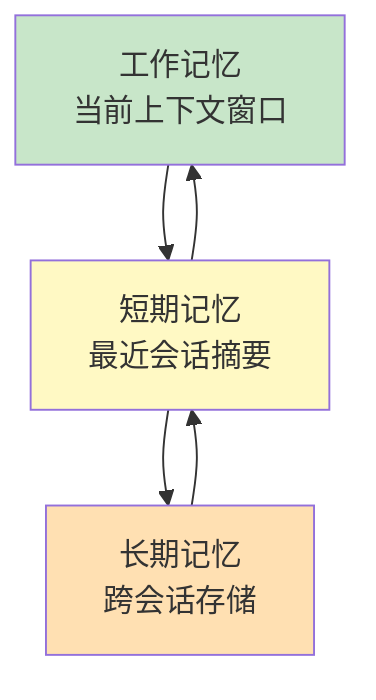
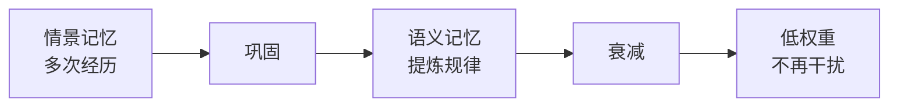

# 第 14 章：Agent 记忆架构

> 📍 [学习路径](../../moc/learning-path.md) · [第 3 层](../../moc/layer-3-agent-engineering.md) · 上一章：[第 13 章](chap-13-from-chat-to-agent.md) · 下一章：[第 15 章](chap-15-planning-reasoning.md)

## 🍅 番茄钟规划

75min，3 番茄钟：番茄1（记忆本质+三层结构）→ 番茄2（三种类型+检索衰减）→ 番茄3（记忆 vs 上下文 vs RAG+复习题）

## 📋 前置回顾

- 第 11 章：上下文工程的「存」策略是什么？
- 第 12 章：RAG 检索的是什么？
- 第 13 章：Agent 四件套里记忆负责什么？

## 🔍 预习

第 13 章 Agent 能自主多步执行。但跑久了——昨天做了什么、上次踩了什么坑、用户的偏好——Agent 怎么记得？这就是**记忆系统**。没有它，Agent 每次都是「失忆重启」；有了它，Agent 能跨会话积累经验。

## 📖 正文

### 1.1 记忆的本质：哪些过去可以继续影响未来

[[concepts/agent-memory-architecture|Agent 记忆架构]] 精确定义：

> Agent Memory 不是简单的对话历史存储，而是解决「**哪些过去可以继续影响未来**」的跨会话治理子系统。

关键词「**治理**」——不是全存，是有选择地存、有策略地用。

### 1.2 记忆 vs 上下文 vs RAG

| 概念 | 定位 | 关键特征 |
|---|---|---|
| **上下文窗口** | 当前工作集 | 临时、可丢弃；让本轮推理可解 |
| **RAG** | 外部知识检索 | 查完即用，不存个人经历 |
| **Agent 记忆** | 跨会话治理 | 存个人经历、偏好、教训 |

RAG 查的是「通用知识」，记忆存的是「这个 Agent 的经历」。

### 1.3 三层记忆基质

[[concepts/agent-memory-substrate-three-layer|三层记忆基质]]：

- **工作记忆**：当前推理能直接看到的（上下文窗口）
- **短期记忆**：最近几次会话的摘要
- **长期记忆**：跨会话的结构化存储（向量库/知识图谱）

### 1.4 三种记忆类型

AI Agent 记忆类型 借鉴认知科学：

| 类型 | 存什么 | 例子 |
|---|---|---|
| **工作记忆** | 当前任务状态 | 「正在调研技术 X」 |
| **情景记忆** | 具体经历 | 「昨天用户让我做 Y，我失败了」 |
| **语义记忆** | 抽象知识 | 「用户偏好简洁回答」 |

情景记忆是「事件」，语义记忆是「规律」。Agent 要从大量情景中提炼语义记忆。

### 1.5 检索与衰减

[[concepts/memory-consolidation-decay|记忆巩固与衰减]] 两个机制：
- **检索**：用向量相似度/时间近度/重要性评分找相关记忆
- **衰减**：旧记忆权重降低，避免噪音淹没；定期「巩固」把高频情景提炼成语义记忆

类比人脑：你不会记得每天吃的饭（情景），但记得「我不爱吃辣」（语义）。

## 🎯 重点回顾

1. **Agent 记忆** = 跨会话治理「哪些过去影响未来」
2. **vs 上下文**：记忆持久，上下文临时
3. **vs RAG**：记忆存个人经历，RAG 查通用知识
4. **三层基质**：工作 / 短期 / 长期
5. **三种类型**：工作 / 情景 / 语义
6. **检索 + 衰减** 让记忆不爆不噪

## 🧠 费曼练习

> 向 12 岁孩子解释「Agent 的工作记忆和长期记忆有什么不同」。

提示：工作记忆像你正在做的作业（桌上），长期记忆像你的笔记本（柜子里）。

## ✅ 复习题

1. **[选择题]** Agent 记忆和 RAG 的核心区别？ A. 记忆用向量，RAG 用关键词 B. 记忆存个人经历，RAG 查通用知识 C. 记忆更快 D. 没区别
2. **[问答题]** 三层记忆基质是什么？它们怎么互相流动？
3. **[场景题]** Agent 跨 10 个会话服务同一用户。怎么设计记忆让它「越用越懂这个用户」？
4. **[费曼题]** 用 3 句话向新手解释「情景记忆和语义记忆的区别」。
5. **[关联题]** 回顾第 11 章上下文工程的「压」策略。记忆系统的「巩固」和「压」有什么异同？

??? answer "参考答案"
    1. **B**
    2. 工作（当前窗口）/ 短期（最近摘要）/ 长期（跨会话存储）。流动：长期→短期→工作（按需加载）；工作→短期→长期（巩固存储）。
    3. 设计：① 每次会话存情景记忆；② 定期巩固成语义记忆（用户偏好、常见任务）；③ 下次会话先检索相关语义记忆进工作记忆；④ 长期记忆用向量库 + 时间衰减。
    4. 情景记忆是具体事件（"昨天发生了X"），语义记忆是抽象规律（"用户喜欢Y"）。情景是原材料，语义是提炼结论。
    5. 同：都是压缩减少信息量。异：「压」是上下文内的临时压缩；「巩固」是跨会话的结构化提炼（从多次情景抽规律）。

## 📚 拓展阅读

- [[concepts/agent-memory-architecture|Agent 记忆架构]] — 本章主源
- AI Agent 记忆类型
- [[concepts/agent-memory-substrate-three-layer|三层记忆基质]]
- [[concepts/memory-consolidation-decay|记忆巩固与衰减]]
- [[concepts/episodic-vs-semantic-memory-agent|情景 vs 语义]]
- [[concepts/working-set-vs-long-term-memory|工作集 vs 长期]]
- [[entities/agent-memory-modular-framework|Agent Memory 模块化框架]]
- [[entities/hermes-agent-memory-system-architecture|Hermes 记忆架构]]
- [[raw/articles/agent-memory-architecture-past-influence-future-ruofei|记忆架构：过去影响未来]]

## ⏭️ 下一章预告

第 15 章讲 **规划与推理**——Agent 怎么分解任务、怎么反思改进。
