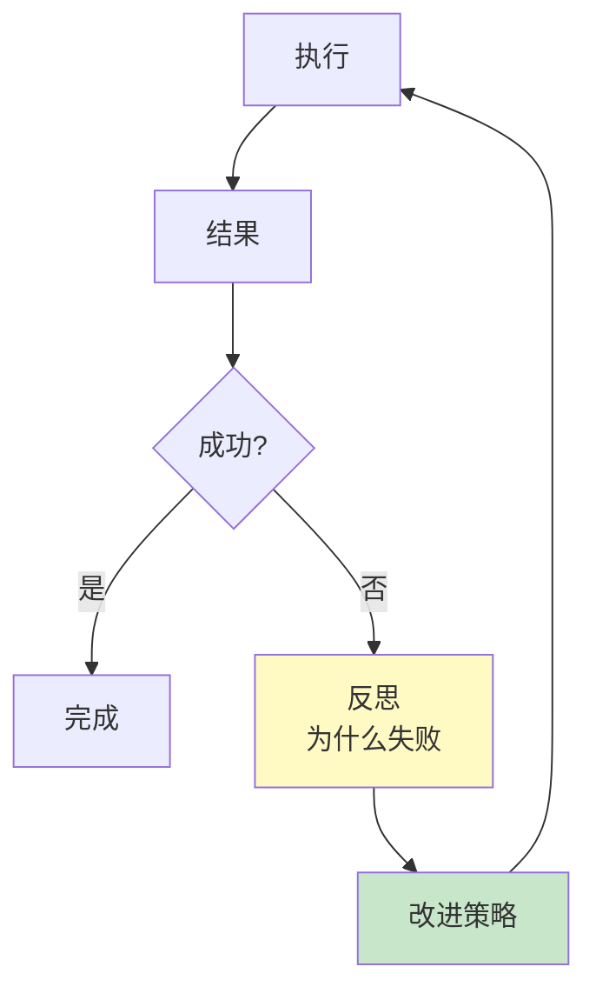

# 第 15 章：规划与推理

> 📍 [学习路径](../../moc/learning-path.md) · [第 3 层](../../moc/layer-3-agent-engineering.md) · 上一章：[第 14 章](chap-14-agent-memory.md) · 下一章：[第 16 章](chap-16-tools-mcp.md)

## 🍅 番茄钟规划

50min，2 番茄钟：番茄1（任务分解+链式推理）→ 番茄2（反射机制+Reasoning Models+复习题）

## 📋 前置回顾

- 第 10 章：CoT 是什么？
- 第 13 章：ReAct Loop 三个步骤？
- 第 14 章：情景记忆存什么？

## 🔍 预习

第 13 章 Agent 能自主多步，但如果任务复杂（如「重构这个项目」），直接 ReAct 会乱——因为它不会先规划。这一章讲 Agent 的「思考能力」：**怎么分解任务、怎么链式推理、怎么反思错误**。

## 📖 正文

### 1.1 任务分解：把大目标拆成小步骤

Agent 规划与推理 的核心：复杂任务先**分解**再执行。

```
目标：重构这个项目
  ↓ 分解
1. 理解项目结构
2. 找出坏味道
3. 设计重构方案
4. 逐步实施
5. 测试验证
```

分解让每步可执行、可验证、可回滚。不分解放手让 Agent 干，容易陷入「打地鼠」（第 1 章 vibe coding 的教训）。

### 1.2 链式推理：CoT 的 Agent 版

第 10 章的 CoT 是单轮内的推理。Agent 版是**跨多步的链式推理**：

```
步骤 1 推理 → 行动 → 观察
   ↓ 基于观察
步骤 2 推理 → 行动 → 观察
```

每步推理都基于前一步的观察，形成链。[[concepts/tool-use-reasoning|工具使用推理]] 称之为「决策与执行分离」——模型决定，框架执行，结果回灌。

### 1.3 反射机制（Reflexion）

Agent 规划与推理 的 Reflexion 模式：



Agent 失败后不只重试，而是**反思根因**，把教训存入记忆（第 14 章的情景记忆），下次避免同样错误。

### 1.4 计划-执行-重规划

复杂任务计划会变。完整流程：`初始规划 → 执行几步 → 发现偏差 → 重规划 → 继续执行`。不是一次规划到底，而是**动态调整**。

### 1.5 Reasoning Models：内置 CoT

Reasoning Models 介绍 o1/R1 类模型——**训练时就内化了长思考**。

| 类型 | 代表 | CoT |
|---|---|---|
| 普通模型 | GPT-4/Claude | 需 Prompt 触发 |
| Reasoning 模型 | o1/DeepSeek-R1 | 内置，自动长思考 |

Reasoning 模型用第 6 章讲的 GRPO 训练，学会「先想再答」。代价是推理慢、贵，但复杂任务更准。

## 🎯 重点回顾

1. **任务分解**：复杂任务先拆再执行
2. **链式推理**：跨多步的 CoT，决策与执行分离
3. **Reflexion**：失败后反思根因，存记忆避免重蹈
4. **计划-执行-重规划**：动态调整，比纯 Plan 灵活
5. **Reasoning Models**：内置 CoT，复杂任务更准但更贵

## 🧠 费曼练习

> 向 12 岁孩子解释「Agent 为什么犯错后要反思」。

提示：像做错题要订正，光重做不改方法会一直错。

## ✅ 复习题

1. **[选择题]** Reflexion 和简单重试的区别？ A. Reflexion 更快 B. Reflexion 失败后反思根因再改 C. 重试不用记忆 D. 没区别
2. **[问答题]** 为什么复杂任务要「计划-执行-重规划」而不是一次规划到底？
3. **[场景题]** Agent 做代码 review，总是漏掉一类 bug。用 Reflexion 思路怎么改进？
4. **[费曼题]** 用 3 句话向新手解释「Reasoning 模型和普通模型的区别」。
5. **[关联题]** 回顾第 10 章 CoT 和第 14 章情景记忆。Reflexion 的「反思存记忆」是怎么把 CoT 和情景记忆结合的？

??? answer "参考答案"
    1. **B**
    2. 复杂任务有未知性，初始计划基于推测，执行中会发现现实和预想不同。重规划能基于实际进展调整，避免走死路。
    3. ① 漏 bug 后反思为什么漏；② 把反思存情景记忆；③ 下次 review 前检索相关记忆进上下文；④ 巩固成语义记忆。
    4. 普通模型需 Prompt 提示才写推理；Reasoning 模型训练时就学了长思考，自动展开推理，复杂任务更准但推理慢、贵。
    5. Reflexion 失败后用 CoT 写出反思，然后把反思结论存入情景记忆。下次类似任务检索该记忆，让 CoT 站在过往教训上推理。

## 📚 拓展阅读

- Agent 规划与推理 — 本章主源
- [[concepts/tool-use-reasoning|工具使用推理]] — 决策与执行分离
- Reasoning Models — o1/R1
- Agent 循环设计 — Reflexion Loop
- [[entities/17-agent-architectures-evolution|17 种 Agent 架构]]
- [[raw/articles/17-agent-architectures-evolution|17 种 Agent 架构]]

## ⏭️ 下一章预告

第 16 章讲 **工具使用与 MCP**——Agent 怎么调用外部系统。这是 Agent「动手」的能力。
