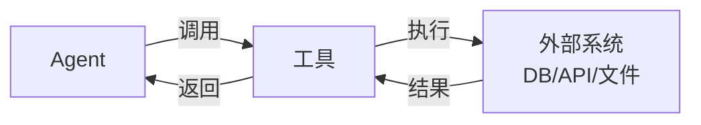

# 第 16 章：工具使用与 MCP

> 📍 [学习路径](../../moc/learning-path.md) · [第 3 层](../../moc/layer-3-agent-engineering.md) · 上一章：[第 15 章](chap-15-planning-reasoning.md) · 下一层：[第 4 层](../../moc/layer-4-ecosystem.md)

## 🍅 番茄钟规划

50min，2 番茄钟：番茄1（工具本质+Function Calling）→ 番茄2（MCP+工具设计原则+关卡）

## 📋 前置回顾

- 第 13 章：Agent 四件套里工具负责什么？
- 第 15 章：决策与执行分离指什么？
- 第 10 章：CoT 和工具调用有什么关系？

## 🔍 预习

Agent 要「动手」——查数据库、调 API、读文件、执行代码。这都要用**工具**。但工具怎么接？每个 API 都自己封装一套？Anthropic 提出了 **MCP（Model Context Protocol）**——一个标准协议，让 Agent 和工具解耦。

## 📖 正文

### 1.1 工具的本质

[[concepts/tool-use-patterns-ai-agents|Tool Use 模式]] 定义：工具是 Agent 与外部系统交互的接口。



没有工具，Agent 只能生成文字；有了工具，Agent 能改世界。

### 1.2 Function Calling：基础范式

[[concepts/tool-use-reasoning|工具使用推理]] 介绍主流范式：
```
1. 模型收到任务 + 可用工具列表
2. 模型决定调用哪个工具、传什么参数
3. 框架执行工具，返回结果
4. 模型基于结果继续推理
```

模型负责「决定」，框架负责「执行」——这就是第 15 章的决策与执行分离。

### 1.3 MCP：标准协议

[[concepts/model-context-protocol-mcp|MCP]] 是 Anthropic 2024 年提出的标准。解决一个痛点：**每个 Agent 框架都自己定义工具接口，工具无法复用**。

MCP 之前：LangChain 工具 ≠ AutoGPT 工具 ≠ Claude Code 工具，同一个 API 要封装 N 次。

MCP 之后：工具按 MCP 协议暴露，任何支持 MCP 的 Agent 都能用，一次封装处处可用。

> 「好的 MCP Server，不是 API 的翻译层，而是 Agent 面向任务的产品接口。」

### 1.4 工具设计原则

| 原则 | 说明 |
|---|---|
| **粒度** | 别太细（一堆小工具难选）也别太粗（一个大工具难用） |
| **描述清晰** | 工具描述要让模型懂「什么时候用、怎么用」 |
| **反馈明确** | 返回结果要可解析，错误要明确 |
| **幂等可重试** | 同样参数应得同样结果，失败能安全重试 |

### 1.5 工具选择：模型怎么挑

Agent 面对一堆工具怎么选？几种策略：
- **按描述匹配**：任务和工具描述语义相似
- **按历史成功率**：上次用 X 成功，这次优先
- **组合调用**：复杂任务调多个工具串联

工具越多，选择越难——这就是为什么工具要分类、要描述清晰。

## 🎯 重点回顾

1. **工具** = Agent 与外部系统的接口
2. **Function Calling**：模型决定，框架执行
3. **MCP** 解决工具不可复用痛点，标准协议
4. **工具设计**：粒度/描述/反馈/幂等
5. **工具选择**：描述匹配 + 历史成功率 + 组合

## 🧠 费曼练习

> 向 12 岁孩子解释「MCP 为什么重要」。

提示：以前每个电器用不同插头，MCP 像统一了插座标准。

## ✅ 复习题

1. **[选择题]** MCP 解决的核心问题是？ A. 工具太慢 B. 工具接口不统一，无法复用 C. 工具不够多 D. 模型不会用工具
2. **[问答题]** Function Calling 的「决策与执行分离」是什么意思？为什么重要？
3. **[场景题]** Agent 有 20 个工具，经常选错。从描述、粒度、分类三方面给优化方向。
4. **[费曼题]** 用 3 句话向新手解释「工具粒度太细和太粗各有什么问题」。
5. **[关联题]** 回顾第 12 章 RAG。RAG 和工具调用有什么关系？RAG 算不算一种工具？

??? answer "参考答案"
    1. **B**
    2. 模型决定调哪个工具、传什么参数（决策）；框架实际执行工具调用（执行）。重要因为模型擅长判断不擅长可靠执行，分离让模型聚焦决策，框架保证执行可靠。
    3. 描述：每个工具描述写清「何时用、输入输出、典型场景」；粒度：合并过细的工具，拆分过粗的工具，目标 5-15 个中等粒度；分类：按用途分组（检索类/操作类/分析类）。
    4. 太细：模型要在很多小工具里选，难匹配，调用链长；太粗：一个大工具参数多，模型难正确传参。要找中间粒度。
    5. RAG 本质是「检索工具」——Agent 调用它查知识库。在 Agentic RAG 模式里，RAG 就是一个工具。所以 RAG 可以包装成 MCP 工具供 Agent 调用。

## 📚 拓展阅读

- [[concepts/model-context-protocol-mcp|MCP]] — 本章主源
- [[concepts/tool-use-patterns-ai-agents|Tool Use 模式]] — 设计原则
- [[concepts/tool-use-reasoning|工具使用推理]] — Function Calling/ReAct
- MCP 生态
- Agentic RAG — RAG 作为工具
- [[entities/anthropic-12-mcp-production-patterns|12 个 MCP 生产模式]]
- [[raw/articles/anthropic-12-mcp-production-patterns|12 个 MCP 模式]]

## 🚪 第 3 层关卡

恭喜完成第 3 层！回答 [第 3 层 MOC](../../moc/layer-3-agent-engineering.md) 的 5 道关卡题。

## ⏭️ 下一层预告

第 4 层讲 **生态工具**——Harness 工程框架、多 Agent 协作、开源生态、评测基准。这是把单个 Agent 变成可靠系统的工程层。
