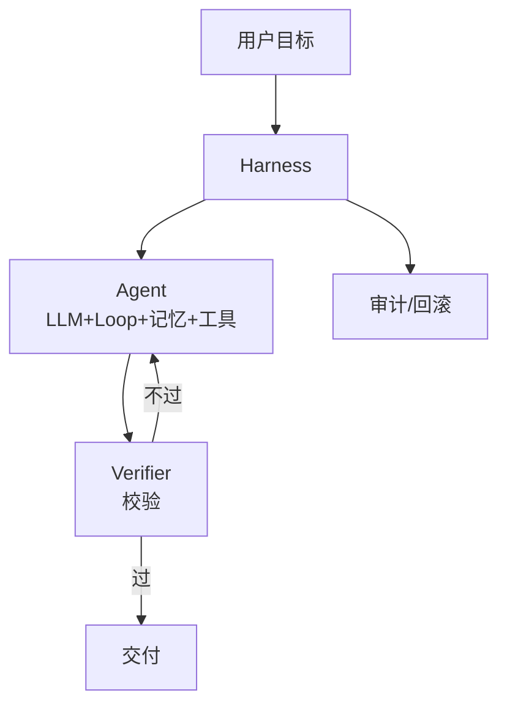
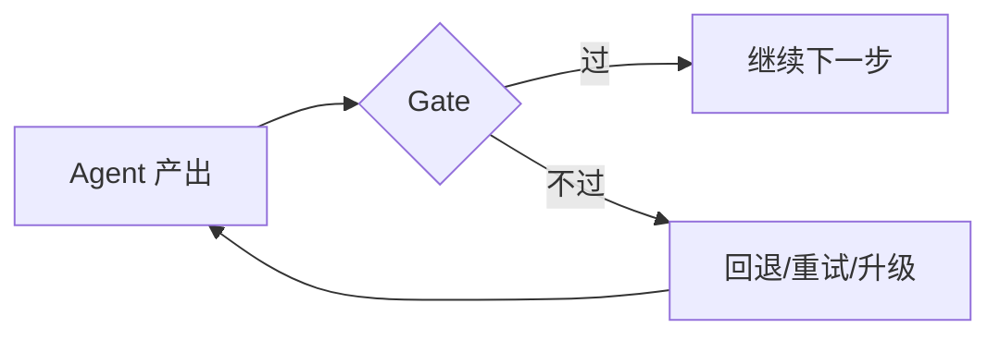

# 第 17 章：Harness 工程框架

> 📍 [学习路径](../../moc/learning-path.md) · [第 4 层](../../moc/layer-4-ecosystem.md) · 上一章：[第 16 章](chap-16-tools-mcp.md) · 下一章：[第 18 章](chap-18-multi-agent.md)

## 🍅 番茄钟规划

75min，3 番茄钟：番茄1（Harness 是什么+三件套）→ 番茄2（七层框架+Gate 评估）→ 番茄3（Harness vs Vibe Coding+复习题）

## 📋 前置回顾

- 第 13 章：Agent 四件套是什么？
- 第 15 章：Reflexion 失败后做什么？
- 第 1 章：vibe coding 为什么崩盘？

## 🔍 预习

第 1 章你学了 vibe coding 会崩盘——因为只有 prompt，没有工程化。第 3 层你学了 Agent 怎么设计，但单个 Agent 仍可能失控。这一章讲 **Harness**——把 Agent 包进**可托管、可验证、可问责**的系统。这是 Karpathy 2026 年提的 agentic engineering 的核心。

## 📖 正文

### 1.1 Harness 是什么

[[concepts/harness-engineering-framework|Harness 工程框架]] 定义：Harness 是围绕 LLM 构建的**工程系统**，让 Agent 可靠、可托管、可问责。

```
Harness ≠ Agent
Harness = 包裹 Agent 的工程系统
```



### 1.2 三件套：Harness + Context + Verifier

[[concepts/agentic-engineering-paradigm|agentic engineering 范式]] Karpathy 的三件套：

| 组件 | 作用 |
|---|---|
| **Harness** | 包裹 Agent 的工程系统，管调度/重试/审计 |
| **Context** | 给 Agent 正确信息（第 11 章上下文工程） |
| **Verifier** | 自动校验 Agent 产出，不过就回退 |

> 核心对象从「代码生成」迁移到「harness + context + verifier」三件套。

### 1.3 七层框架

[[concepts/harness-engineering-7-layers-framework|Harness 七层框架]]：
1. **目标层**：用户意图解析
2. **规划层**：任务分解
3. **执行层**：Agent Loop
4. **工具层**：MCP 工具调用
5. **记忆层**：跨会话存储
6. **校验层**：Verifier
7. **交付层**：审计/回滚/发布

### 1.4 Gate 评估：Verifier 的具体化

Harness Gate 评估 介绍 Gate 机制——Agent 每步产出过「门」：



Gate 可以是：单元测试（代码 Agent）/格式校验（结构化输出）/人工审核（高风险任务）/第二个 Agent 交叉验证。

### 1.5 Harness 解决了 vibe coding 的崩盘

回顾第 1 章 vibe coding 崩盘曲线：Day 1-3 爽 → Day 7 乱 → Day 14 失控。根因：只有 prompt（3.0），没有 harness（1.0 工程化）+ verifier。

Harness 怎么解：**可托管**（Agent 不需要人实时盯）/ **可验证**（每步过 Gate，错就回退）/ **可问责**（每步可追溯，能定位根因）。这就是第 1 章说的「系统不依赖人的实时在场」。

## 🎯 重点回顾

1. **Harness** = 包裹 Agent 的工程系统（不是 Agent 本身）
2. **三件套**：Harness + Context + Verifier
3. **七层框架**：目标/规划/执行/工具/记忆/校验/交付
4. **Gate 评估**：每步过门，不过回退
5. **解决 vibe coding 崩盘**：可托管/可验证/可问责

## 🧠 费曼练习

> 向 12 岁孩子解释「Harness 为什么让 Agent 可靠」。

提示：Agent 像会做事但会犯错的学徒，Harness 像带他的老师傅，每步检查再放行。

## ✅ 复习题

1. **[选择题]** Harness 三件套是？ A. Prompt+Model+Output B. Harness+Context+Verifier C. Loop+Memory+Tool D. Plan+Execute+Reflect
2. **[问答题]** Gate 评估是什么？为什么重要？
3. **[场景题]** 代码 Agent 经常生成有 bug 的代码。用 Harness 思路怎么改进？
4. **[费曼题]** 用 3 句话向新手解释「Harness 和 Agent 的区别」。
5. **[关联题]** 回顾第 1 章 vibe coding 崩盘 + 第 15 章 Reflexion。Harness 的 Verifier 和 Reflexion 的反思有什么联系和区别？

??? answer "参考答案"
    1. **B**
    2. Gate 是 Agent 产出的校验关卡——每步产出过门才继续，不过就回退/重试/升级。重要因为 Agent 会错，Gate 把错误挡在交付前，避免错误累积爆炸。
    3. 加 Verifier Gate：① 生成后跑单元测试；② 静态分析 lint；③ 让另一个 Agent 交叉 review；④ 都过了才提交。每步可回退到上一个过 Gate 的版本。
    4. Agent 是会推理会动手的核心；Harness 是包裹它的工程系统。Agent 像发动机，Harness 像整辆车（含刹车/仪表/安全带）。
    5. 联系：都检查错误并改进。区别：Reflexion 是 Agent 内部的反思（存记忆）；Verifier 是 Harness 外部的校验（客观判定过不过）。前者是 Agent 学习，后者是系统把关。理想结合——Verifier 判错后触发 Reflexion 反思。

## 📚 拓展阅读

- [[concepts/harness-engineering-framework|Harness 工程框架]] — 本章主源
- [[concepts/harness-engineering-7-layers-framework|Harness 七层]]
- Gate 评估
- [[concepts/agentic-engineering-paradigm|agentic engineering 范式]]
- [[concepts/harness-loop-architecture|Harness Loop]]
- [[entities/agent-harness-architecture-design-production-guide|Agent Harness 生产指南]]
- [[entities/harness-engineering-core-patterns-claude-code|Harness 核心模式]]
- [[raw/articles/harness-engineering-systematic-explainer|Harness 系统解释]]
- [[entities/harness-engineering-framework|Harness 七层]]

## ⏭️ 下一章预告

第 18 章讲 **多 Agent 协作**——多个 Agent 怎么分工合作。
