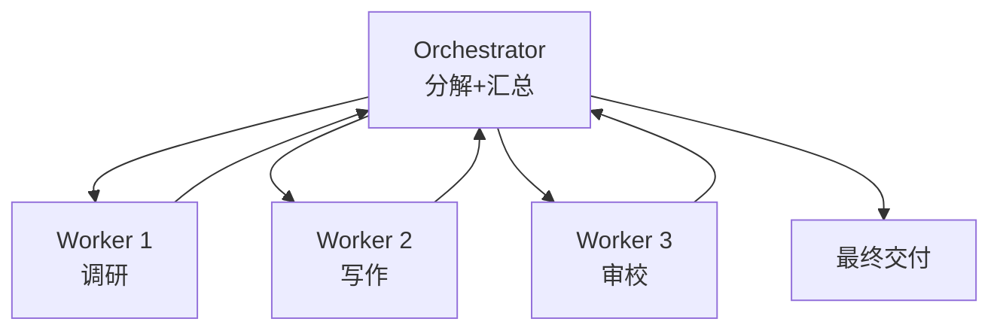
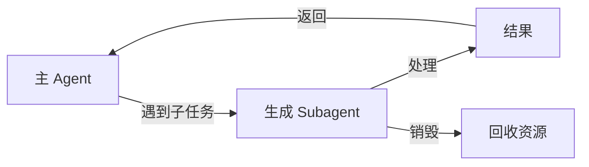

# 第 18 章：多 Agent 协作

> 📍 [学习路径](../../moc/learning-path.md) · [第 4 层](../../moc/layer-4-ecosystem.md) · 上一章：[第 17 章](chap-17-harness-framework.md) · 下一章：[第 19 章](chap-19-open-source-ecosystem.md)

## 🍅 番茄钟规划

50min，2 番茄钟：番茄1（为什么多 Agent+协作模式）→ 番茄2（Orchestrator-Worker+上下文隔离+复习题）

## 📋 前置回顾

- 第 13 章：Agent 四件套？
- 第 17 章：Harness 三件套？
- 第 11 章：上下文工程的核心问题？

## 🔍 预习

第 3 层你学了单个 Agent 怎么设计。但有些任务一个 Agent 干不了——比如「写一篇深度报告」要调研、写作、审校，一个 Agent 上下文装不下所有角色。这一章讲 **多 Agent 协作**：把任务拆给多个专业 Agent，每个聚焦自己的事。

## 📖 正文

### 1.1 为什么需要多 Agent

[[concepts/multi-agent-systems|多 Agent 系统]]：

| 痛点 | 多 Agent 解法 |
|---|---|
| 单 Agent 上下文爆 | 每个 Agent 独立上下文 |
| 角色混乱 | 每个 Agent 专注一个角色 |
| 单点失败 | 多 Agent 可冗余/接力 |
| 难并行 | 多 Agent 真并行 |

### 1.2 协作模式

[[concepts/multi-agent-collaboration-patterns|多 Agent 协作模式]] 主流几种：

**Orchestrator-Worker**：一个调度 Agent 分任务给多个 Worker。
```
Orchestrator → Worker A
            → Worker B
            → Worker C
```

**Pipeline**：Agent 串联，前一个输出是后一个输入。
```
调研 Agent → 写作 Agent → 审校 Agent
```

**Debate**：多个 Agent 对同一问题各抒己见，投票或综合。

**Hierarchical**：树状结构，上层管下层。

### 1.3 Orchestrator-Worker：最常用

[[concepts/orchestrator-worker-architecture|Orchestrator-Worker]] 是最常用模式：



Orchestrator 负责分解任务、分配给 Worker、汇总结果。Worker 只管自己那块。

### 1.4 上下文隔离：关键设计

[[concepts/multi-agent-context-isolation|多 Agent 上下文隔离]] 强调：每个 Agent 应有**独立上下文**，不互相污染。

```
差：所有 Agent 共享一个大上下文 → 噪音互相干扰
好：每个 Agent 独立上下文，只通过消息传必要信息
```

这呼应第 11 章上下文工程——给每个 Agent 它需要的，不是给它全部。

### 1.5 Subagent 生成

Subagent 生成模式：主 Agent 动态生成子 Agent 处理子任务，完成后回收。



好处：资源按需分配，子 Agent 上下文用完即弃，不占主 Agent 窗口。Claude Code 的 subagent 就是这个机制。

## 🎯 重点回顾

1. **多 Agent** 解决单 Agent 上下文爆/角色乱/单点失败
2. **四种模式**：Orchestrator-Worker / Pipeline / Debate / Hierarchical
3. **Orchestrator-Worker** 最常用，调度+执行分离
4. **上下文隔离**：每个 Agent 独立上下文，只传必要消息
5. **Subagent 生成**：主 Agent 动态生子 Agent，用完回收

## 🧠 费曼练习

> 向 12 岁孩子解释「为什么要多个 Agent 合作」。

提示：一个人做完所有事会累会乱，分工合作各做各的更高效。

## ✅ 复习题

1. **[选择题]** Orchestrator-Worker 模式中 Orchestrator 负责？ A. 执行子任务 B. 分解任务+汇总结果 C. 训练模型 D. 存记忆
2. **[问答题]** 为什么多 Agent 要「上下文隔离」？
3. **[场景题]** 造一个「自动写技术博客」系统。用 Pipeline 模式设计 3 个 Agent 的协作流程。
4. **[费曼题]** 用 3 句话向新手解释「Subagent 生成模式」。
5. **[关联题]** 回顾第 17 章 Harness。多 Agent 系统里，Harness 该放在哪？

??? answer "参考答案"
    1. **B**
    2. 共享上下文会让各 Agent 互相干扰——A 的工具结果污染 B 的推理。隔离让每个 Agent 只看自己需要的，信号清晰，也省 token。
    3. ① 调研 Agent：搜资料、整理要点；② 写作 Agent：基于要点写初稿；③ 审校 Agent：审校语法/逻辑/准确性。前一个输出是后一个输入。
    4. 主 Agent 遇到子任务就生成一个专门子 Agent 处理，子 Agent 用独立上下文干活，完成后把结果返回主 Agent 并销毁，主 Agent 上下文不被污染。
    5. 两层都有。每个 Worker Agent 有自己的轻 Harness（管自己的 Loop+Verifier）；整个系统有顶层 Harness 管 Orchestrator 的调度、Worker 间的消息、整体 Verifier 和审计。

## 📚 拓展阅读

- [[concepts/multi-agent-systems|多 Agent 系统]] — 本章主源
- [[concepts/multi-agent-collaboration-patterns|协作模式]]
- [[concepts/orchestrator-worker-architecture|Orchestrator-Worker]]
- [[concepts/multi-agent-context-isolation|上下文隔离]]
- Subagent 生成
- [[entities/agentscope-java-2.0-enterprise-distributed-harness|AgentScope Java]]
- [[entities/openclaw-multi-agent-team-practice|OpenClaw 多 Agent]]
- [[raw/articles/openclaw-multi-agent-team-practice|OpenClaw 多 Agent]]

## ⏭️ 下一章预告

第 19 章讲 **开源生态**——LangGraph/AutoGen/CrewAI 等框架怎么选。
