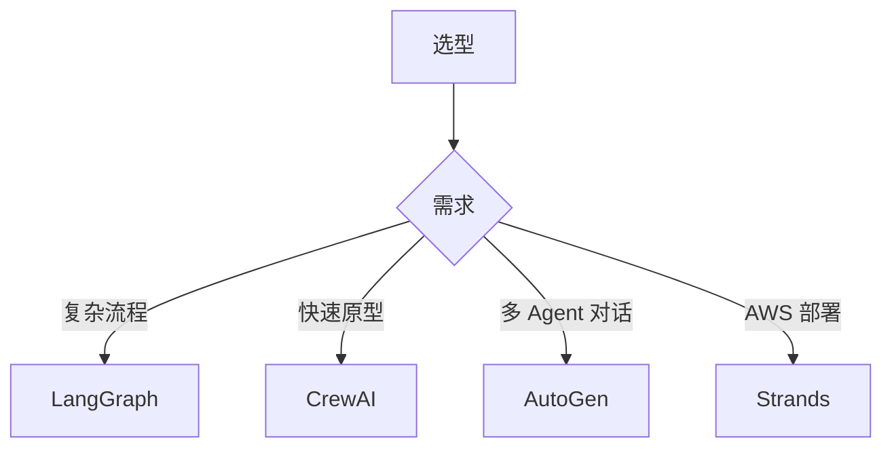

# 第 19 章：开源生态

> 📍 [学习路径](../../moc/learning-path.md) · [第 4 层](../../moc/layer-4-ecosystem.md) · 上一章：[第 18 章](chap-18-multi-agent.md) · 下一章：[第 20 章](chap-20-evaluation-benchmarks.md)

## 🍅 番茄钟规划

50min，2 番茄钟：番茄1（为什么要用框架+LLM 生态）→ 番茄2（Agent 框架+选型建议+复习题）

## 📋 前置回顾

- 第 16 章：MCP 解决什么？
- 第 17 章：Harness 三件套？
- 第 18 章：多 Agent 协作模式？

## 🔍 预习

前面你学了 Agent 怎么设计、怎么协作。但真要落地，从零造一个 Harness 太重——有开源框架可用。这一章给你**生态地图**：LLM 生态、Agent 框架、工具协议。

## 📖 正文

### 1.1 为什么要用框架

[[concepts/open-source-ai-ecosystem|开源 AI 生态]]：

| 自己造 | 用框架 |
|---|---|
| 完全可控 | 站在巨人肩膀 |
| 费时费力 | 快速验证 |
| 容易踩坑 | 社区踩过坑 |
| 难升级 | 跟着社区升级 |

原则：**核心逻辑自造，工程能力用框架**。

### 1.2 LLM 生态

开源 LLM 生态 + 开源模型对比：

| 模型 | 特点 |
|---|---|
| Llama 系列 | Meta，生态最广 |
| Qwen 系列 | 阿里，中文强 |
| DeepSeek | 推理强（R1） |
| Mistral | 欧洲，轻量 |
| GLM | 智谱，中文 |

选型维度：能力/许可/部署成本/中文支持/推理 vs 通用。

### 1.3 Agent 框架

Agent 框架对比 + 开源 Agent 框架：

| 框架 | 特点 | 适合 |
|---|---|---|
| **LangGraph** | 图结构，状态机 | 复杂流程控制 |
| **AutoGen** | 微软，多 Agent 对话 | 多 Agent 协作 |
| **CrewAI** | 角色化，简单 | 快速搭多 Agent |
| **OpenAI Agents SDK** | 官方，轻量 | 接 OpenAI 生态 |
| **Strands** | AWS，AgentCore | AWS 部署 |
| **OWL** | 多模态 | 复杂任务 |

### 1.4 选型建议

1. **学习曲线**：CrewAI 最简，LangGraph 陡
2. **生产就绪**：LangGraph/AutoGen 成熟，新框架待验证
3. **生态**：LangGraph 生态最广
4. **可控性**：LangGraph 最灵活，CrewAI 最简
5. **托管**：AWS 选 Strands，OpenAI 选官方 SDK

### 1.5 工具协议生态

第 16 章讲的 MCP 已成事实标准。Anthropic/OpenAI/各框架都支持。选框架时确认它支持 MCP——这样工具可跨框架复用。

## 🎯 重点回顾

1. **核心自造，工程用框架**
2. **LLM 生态**：Llama/Qwen/DeepSeek/Mistral/GLM
3. **Agent 框架**：LangGraph/AutoGen/CrewAI 等
4. **选型维度**：学习曲线/生产就绪/生态/可控/托管
5. **MCP 成事实标准**，选框架要支持它

## 🧠 费曼练习

> 向 12 岁孩子解释「为什么要用开源框架而不是自己造」。

提示：盖房子不用自己造砖瓦，用现成的更省事。

## ✅ 复习题

1. **[选择题]** 复杂流程控制最适合用？ A. CrewAI B. LangGraph C. AutoGen D. 自己造
2. **[问答题]** 选 Agent 框架要考虑哪 5 个维度？
3. **[场景题]** 团队要快速搭个多 Agent 原型验证想法。选哪个框架？为什么？
4. **[费曼题]** 用 3 句话向新手解释「LangGraph 和 CrewAI 的区别」。
5. **[关联题]** 回顾第 16 章 MCP。为什么选框架要确认支持 MCP？

??? answer "参考答案"
    1. **B**
    2. 学习曲线/生产就绪/生态/可控性/托管。
    3. CrewAI。原型要快，CrewAI 学习曲线最浅，角色化定义直观。生产再考虑迁 LangGraph。
    4. LangGraph 是图结构状态机，灵活但复杂；CrewAI 角色化简单，上手快。
    5. MCP 让工具跨框架复用。不支持 MCP 的框架，工具要专门封装，换框架就要重写。支持 MCP 则一次封装处处可用，避免供应商锁定。

## 📚 拓展阅读

- [[concepts/open-source-ai-ecosystem|开源 AI 生态]] — 本章主源
- 开源 Agent 框架
- 框架对比
- 开源 LLM 生态
- 开源模型对比
- MCP 生态
- [[entities/agent-framework-owl-principles|OWL 框架]]
- [[entities/agentium-agent-framework|Agentium]]
- [[entities/agentscope-java-2.0-enterprise-distributed-harness|AgentScope]]

## ⏭️ 下一章预告

第 20 章讲 **评测与基准**——怎么知道 Agent 好不好。
