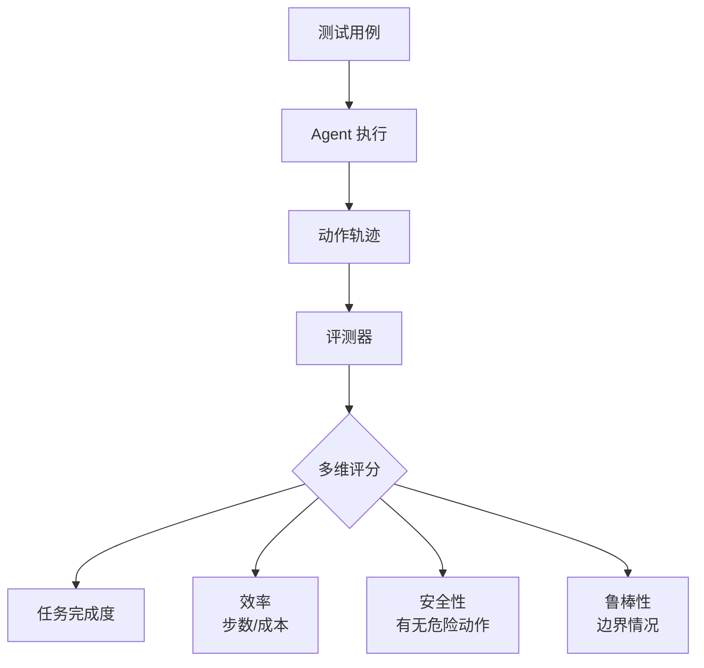

# 第 20 章：评测与基准

> 📍 [学习路径](../../moc/learning-path.md) · [第 4 层](../../moc/layer-4-ecosystem.md) · 上一章：[第 19 章](chap-19-open-source-ecosystem.md) · 下一层：[第 5 层](../../moc/layer-5-production-security.md)

## 🍅 番茄钟规划

50min，2 番茄钟：番茄1（为什么评测+基准类型）→ 番茄2（Agent 评测+评测 Harness+关卡）

## 📋 前置回顾

- 第 17 章：Harness 的 Verifier 是什么？
- 第 18 章：多 Agent 系统怎么交付？
- 第 6 章：SFT/RLHF 用什么数据？

## 🔍 预习

前面 19 章你学了怎么造 Agent。但怎么知道它好不好？「感觉不错」不算数——需要**评测**。这章讲怎么评测 LLM 和 Agent：基准测试、评测 Harness、Agent 专用评测。

## 📖 正文

### 1.1 为什么评测

Agent 评测基准：
- **没有评测就没有改进**——不知道差在哪
- **避免主观感觉**——「感觉好」可能假象
- **回归测试**——改了别退化
- **横向比较**——A/B 选最优

### 1.2 LLM 基准类型

LLM 基准全景：

| 类型 | 例子 | 测什么 |
|---|---|---|
| **知识** | MMLU | 多学科知识 |
| **推理** | GSM8K | 数学推理 |
| **代码** | HumanEval | 代码生成 |
| **对话** | MT-Bench | 多轮对话 |
| **安全** | TruthfulQA | 抗幻觉 |
| **Agent** | SWE-Bench | 真实软件任务 |

### 1.3 Agent 评测的难点

[[concepts/agent-evaluation-benchmark-frameworks|评测框架]] 指出 Agent 评测比 LLM 难：
- **多步执行**——不是单次输出，是一串动作
- **环境影响**——结果依赖工具/环境状态
- **路径多样**——同一目标不同路径都算成功
- **长程任务**——跑几小时，难复现

所以 Agent 评测不能只看「最终答案对不对」，要看过程。

### 1.4 评测 Harness

[[concepts/evaluation-harness-design|评测 Harness 设计]]：

不只是对错，是多维评分。

### 1.5 代码 Agent 专用：SWE-Bench

代码生成评测 介绍 SWE-Bench——给 Agent 真实 GitHub issue，看它能否提 PR 解决。这是目前最接近生产的 Agent 评测。

### 1.6 评测的陷阱

- **数据污染**：基准进了训练集，分数虚高
- **过拟合基准**：为刷分优化，实际不提升
- **单一维度**：只看准确率，忽略成本/安全

好评测要多维 + 防污染 + 接近真实。

## 🎯 重点回顾

1. **没有评测就没有改进**
2. **LLM 基准**：MMLU/GSM8K/HumanEval/SWE-Bench 等
3. **Agent 评测更难**：多步/环境/路径/长程
4. **评测 Harness**：多维评分（完成度/效率/安全/鲁棒）
5. **SWE-Bench** 是最接近生产的 Agent 评测
6. **陷阱**：数据污染/过拟合/单一维度

## 🧠 费曼练习

> 向 12 岁孩子解释「为什么 Agent 评测比考试难」。

提示：考试有标准答案，Agent 像办事，办成的方式很多种，难定标准。

## ✅ 复习题

1. **[选择题]** Agent 评测比 LLM 难因为？ A. Agent 用更强模型 B. Agent 多步执行，路径多样 C. Agent 没有基准 D. Agent 评测不存在
2. **[问答题]** 评测 Harness 应评哪几个维度？
3. **[场景题]** 代码 Agent 上线后用户反馈不稳定。怎么设计评测找出问题？
4. **[费曼题]** 用 3 句话向新手解释「SWE-Bench 为什么重要」。
5. **[关联题]** 回顾第 17 章 Harness 的 Verifier + 本章评测。Verifier 和评测有什么联系和区别？

??? answer "参考答案"
    1. **B**
    2. 任务完成度/效率（步数、成本）/安全性（有无危险动作）/鲁棒性（边界情况）。
    3. ① 收集用户反馈的真实 case 建评测集；② 跑评测 Harness 看完成度/效率/安全；③ 分类失败 case（规划错/工具错/记忆错）；④ 针对性改 + 回归测；⑤ 上线后持续监控。
    4. SWE-Bench 用真实 GitHub issue 测 Agent 能否提 PR 解决——不是 toy task，最接近生产。让 Agent 评测从「刷分」走向「真能干活」。
    5. 联系：都是校验 Agent 产出。区别：Verifier 是 Harness 内部的实时门；评测是离线的整体打分。前者管单次执行，后者管系统能力。Verifier 防错，评测选优。

## 📚 拓展阅读

- Agent 评测基准 — 本章主源
- [[concepts/evaluation-harness-design|评测 Harness 设计]]
- LLM 基准全景
- 代码生成评测
- [[entities/agent-eval-wallezhang-yaml-driven-agent-evaluation|YAML 驱动评测]]
- [[entities/agent-evalkit-aws-opensource-cli-agent-eval-toolkit|AgentEvalKit]]
- [[entities/programbench-swe-agent-benchmark|SWE-Bench]]
- [[raw/articles/agent-eval-wallezhang-yaml-driven-agent-evaluation|YAML 评测]]

## 🚪 第 4 层关卡

恭喜完成第 4 层！回答 [第 4 层 MOC](../../moc/layer-4-ecosystem.md) 的 5 道关卡题。

## ⏭️ 下一层预告

第 5 层讲 **生产与安全**——怎么把 Agent 落地、怎么防御攻击。
