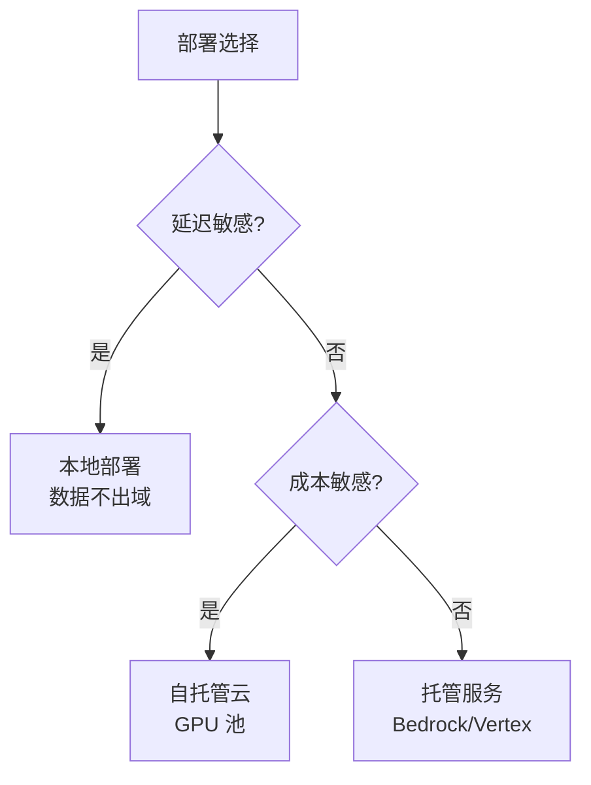

# 第 21 章：生产级 Agent

> 📍 [学习路径](../../moc/learning-path.md) · [第 5 层](../../moc/layer-5-production-security.md) · 上一章：[第 20 章](chap-20-evaluation-benchmarks.md) · 下一章：[第 22 章](chap-22-observability.md)

## 🍅 番茄钟规划

50min，2 番茄钟：番茄1（demo vs 生产+部署策略）→ 番茄2（长程任务+CI/CD+复习题）

## 📋 前置回顾

- 第 17 章：Harness 三件套？
- 第 18 章：多 Agent 怎么协作？
- 第 20 章：评测 Harness 评哪几维？

## 🔍 预习

前面你能造 Agent 了，也能评测了。但 demo 能跑 ≠ 能上线。线上要面对：用户并发、长程任务、失败恢复、版本回滚、成本控制。这一章讲**生产级 Agent 工程**——把 demo 变成 7x24 可靠服务。

## 📖 正文

### 1.1 Demo vs 生产

[[concepts/production-agent-engineering|生产级 Agent 工程]]：

| 维度 | Demo | 生产 |
|---|---|---|
| 用户 | 自己 | 真实用户并发 |
| 失败 | 重启就好 | 要恢复/降级 |
| 成本 | 不在乎 | 按调用计费 |
| 观察 | print | 全链路监控 |
| 版本 | 一个 | 灰度/回滚 |
| 安全 | 信任输入 | 防注入 |

### 1.2 部署策略

Agent 部署策略 + [[concepts/local-vs-cloud-agent-deployment-strategy|本地 vs 云]]：

选型维度：延迟/成本/数据合规/运维能力。

### 1.3 长程任务

[[concepts/long-running-agent-architecture|长程 Agent 架构]] + [[concepts/harness-long-running-task|长程任务 Harness]]：

生产 Agent 可能跑几小时甚至几天。挑战：
- **上下文爆** → 用第 11 章上下文工程 + 第 14 章分层记忆
- **中途失败** → 检查点（checkpoint）+ 恢复
- **成本累积** → 异步执行 + 资源调度
- **用户等待** → 进度反馈 + 中断能力

### 1.4 CI/CD for Agent

AI 持续集成：
- **Prompt 是代码**：版本管理 + 评审
- **评测是测试**：第 20 章的评测 Harness 当 CI
- **灰度发布**：先小流量，监控指标，逐步放量
- **回滚机制**：Prompt/模型/工具都能回滚

### 1.5 AgentOps：运维

AgentOps 是 Agent 时代的 DevOps：部署/扩缩容/监控告警/成本追踪/版本管理/审计日志。

## 🎯 重点回顾

1. **Demo vs 生产**：6 维度差异
2. **部署策略**：本地/自托管云/托管服务
3. **长程任务**：检查点+恢复+异步+进度反馈
4. **CI/CD**：Prompt 是代码，评测是测试
5. **AgentOps**：Agent 时代的 DevOps

## 🧠 费曼练习

> 向 12 岁孩子解释「为什么 demo 能跑不代表能上线」。

提示：demo 像自己骑自行车，生产像开出租车拉客，要面对乘客、堵车、修车。

## ✅ 复习题

1. **[选择题]** 生产 Agent 处理长程任务的关键机制？ A. 用更强模型 B. 检查点+恢复 C. 增大上下文窗口 D. 不做长程任务
2. **[问答题]** Demo 和生产在哪些维度有差异？
3. **[场景题]** Agent 要上线服务 1000 并发用户。从部署、长程、成本、监控四方面给方案。
4. **[费曼题]** 用 3 句话向新手解释「AgentOps 是什么」。
5. **[关联题]** 回顾第 17 章 Harness + 第 20 章评测。生产 CI/CD 怎么把 Harness 和评测结合起来？

??? answer "参考答案"
    1. **B**
    2. 用户/失败/成本/观察/版本/安全。
    3. 部署：托管服务（Bedrock）+ 自动扩缩容；长程：检查点每 N 步存，失败从最近点恢复，异步执行+进度查询；成本：按 token 计费监控+缓存+小模型兜底简单任务；监控：全链路 trace + 告警 + 成本看板。
    4. AgentOps 是 Agent 时代的 DevOps——管 Agent 的部署、扩缩容、监控、成本、版本、审计。
    5. Harness 的 Verifier 作为 CI 的 Gate——每次 Prompt/模型改动，过评测 Harness 才允许上线；评测 Harness 的多维评分作为 CD 的灰度指标——小流量监控，指标退化就回滚。

## 📚 拓展阅读

- [[concepts/production-agent-engineering|生产级 Agent 工程]] — 本章主源
- 部署策略
- [[concepts/long-running-agent-architecture|长程架构]]
- AI CI/CD
- AgentOps
- [[entities/agent-harness-architecture-design-production-guide|Agent Harness 生产指南]]
- [[entities/agentops-operationalize-agentic-ai-at-scale-with-amazon-bedr|AgentOps on Bedrock]]
- [[raw/articles/anthropic-12-mcp-production-patterns|12 个 MCP 生产模式]]

## ⏭️ 下一章预告

第 22 章讲 **可观测性**——线上 Agent 在做什么，怎么看见。
