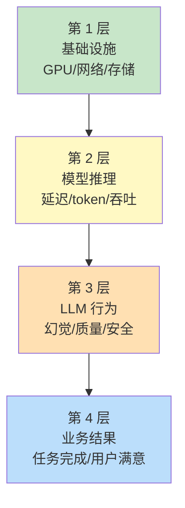

# 第 22 章：可观测性

> 📍 [学习路径](../../moc/learning-path.md) · [第 5 层](../../moc/layer-5-production-security.md) · 上一章：[第 21 章](chap-21-production-agent.md) · 下一章：[第 23 章](chap-23-security-defense.md)

## 🍅 番茄钟规划

50min，2 番茄钟：番茄1（为什么观测+三支柱）→ 番茄2（四层模型+Agent 专用+复习题）

## 📋 前置回顾

- 第 17 章：Harness 的审计指什么？
- 第 21 章：生产 Agent 怎么处理失败？
- 第 11 章：上下文工程的「弃」指什么？

## 🔍 预习

第 21 章你把 Agent 上了线。但上线后——用户说「Agent 答错了」，你怎么定位？成本突然涨了，哪里漏的？这就需要**可观测性**。传统软件有 APM，Agent 时代要新的观测体系。

## 📖 正文

### 1.1 为什么 Agent 可观测性更难

Agent 可观测性：
- **非确定性**：同样输入可能不同输出
- **多步执行**：一个请求是几十个动作
- **工具调用**：要追踪外部系统交互
- **成本累积**：每步都烧 token
- **长程任务**：跨小时甚至跨天

传统 APM 看「请求-响应」够，Agent 要看**整条决策链**。

### 1.2 三支柱：Logs/Metrics/Traces

监控：

| 支柱 | 看什么 | Agent 场景 |
|---|---|---|
| **Logs** | 事件记录 | 每步推理/工具调用日志 |
| **Metrics** | 聚合数值 | token 数/成本/延迟/成功率 |
| **Traces** | 请求链路 | 一次任务的完整决策路径 |

### 1.3 LLM 四层可观测模型

[[concepts/llm-observability-4-layer-model|LLM 四层可观测]]：

只看 L1-L2 不够，L3-L4 才是 Agent 特有的。

### 1.4 Agent 专用观测：决策轨迹

Agent 要看**决策轨迹**——一次任务从开始到结束的全部动作：每步记录思考内容/工具名/参数/结果/耗时/token/成本。

### 1.5 关键指标

| 指标 | 含义 |
|---|---|
| **任务成功率** | 完成vs失败 |
| **平均步数** | 多少步完成 |
| **token 消耗** | 每任务烧多少 |
| **成本** | 每任务多少钱 |
| **延迟** | 端到端时间 |
| **工具失败率** | 哪个工具常挂 |
| **幻觉率** | 编造内容比例 |

## 🎯 重点回顾

1. **Agent 观测更难**：非确定/多步/工具/成本/长程
2. **三支柱**：Logs/Metrics/Traces
3. **四层模型**：基础设施/推理/行为/业务
4. **决策轨迹** 是 Agent 专用观测
5. **关键指标**：成功率/步数/token/成本/延迟/工具失败/幻觉

## 🧠 费曼练习

> 向 12 岁孩子解释「为什么 Agent 上线后要观测」。

提示：像开车要有仪表盘，不然不知道油量、速度、引擎状态。

## ✅ 复习题

1. **[选择题]** Agent 可观测性比传统软件难因为？ A. Agent 不需要观测 B. Agent 非确定+多步+工具调用 C. Agent 没有指标 D. 传统软件也不观测
2. **[问答题]** LLM 四层可观测模型是哪四层？为什么只看基础设施不够？
3. **[场景题]** Agent 成本突然涨 3 倍。用可观测性怎么定位？
4. **[费曼题]** 用 3 句话向新手解释「决策轨迹」是什么。
5. **[关联题]** 回顾第 11 章上下文工程。Agent 的决策轨迹和上下文工程有什么关系？

??? answer "参考答案"
    1. **B**
    2. 基础设施/模型推理/LLM 行为/业务结果。只看基础设施只知硬件健康，不知模型行为质量、不知业务结果。
    3. ① 看 Metrics——成本按任务分布，找异常高成本任务；② 看 Traces——高成本任务的决策轨迹，找哪步烧 token；③ 常见原因：上下文爆/工具返回大量无用数据/陷入循环重试。
    4. 决策轨迹是一次 Agent 任务从开始到结束的全部步骤——每步的思考、工具调用、参数、结果、耗时。
    5. 决策轨迹是「已发生的上下文流转」的记录；上下文工程是「未来上下文怎么管」的策略。观测轨迹能发现上下文工程的问题。

## 📚 拓展阅读

- Agent 可观测性 — 本章主源
- [[concepts/llm-observability-4-layer-model|LLM 四层可观测]]
- 监控
- Agent 可观测
- [[entities/2026-05-14-code-intelligence-1778979927|Code Intelligence]]
- [[raw/articles/llm-observability-4-layer-quant67|LLM 四层可观测]]

## ⏭️ 下一章预告

第 23 章讲 **安全威胁与防御**——Prompt 注入等攻击怎么防。
