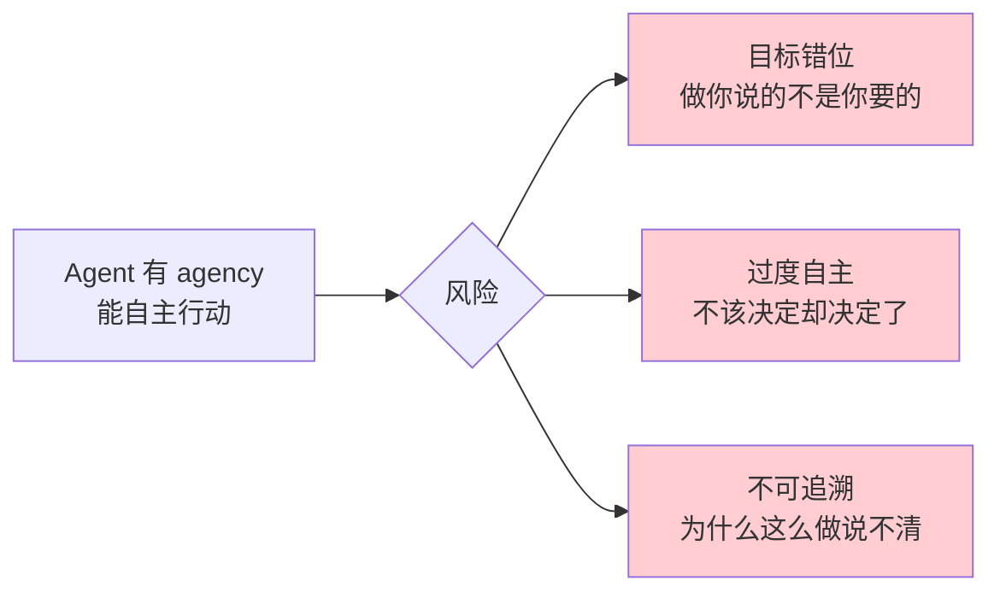

# 第 24 章：治理与红线

> 📍 [学习路径](../../moc/learning-path.md) · [第 5 层](../../moc/layer-5-production-security.md) · 上一章：[第 23 章](chap-23-security-defense.md) · 下一层：[学习路径总入口](../../moc/learning-path.md)

## 🍅 番茄钟规划

50min，2 番茄钟：番茄1（为什么治理+Agency 模型风险）→ 番茄2（合规+红线+终极关卡）

## 📋 前置回顾

- 第 23 章：Prompt 注入怎么防？
- 第 21 章：AgentOps 管什么？
- 第 1 章：vibe coding 为什么崩盘？

## 🔍 预习

前 23 章你学了怎么造、怎么测、怎么部署、怎么防攻击。但还有一个问题：**应不应该做？** Agent 能自主决策——这意味着它能造成真实危害。谁来负责？出错怎么追？什么绝对不能做？这一章讲**治理与红线**——AI 系统的合规、伦理、问责。

## 📖 正文

### 1.1 为什么需要治理

AI 安全治理：
- **Agent 能造成真实危害**（转账/删数据/误导）
- **责任不清**——模型错？开发者错？用户错？
- **法规要求**——EU AI Act、各国合规
- **社会信任**——不治理会被监管叫停

### 1.2 Agency 模型风险

[[concepts/the-agency-model-dangers|Agency 模型风险]]：

Agent 的 agency 越大，风险越大——能力越强越要治理。

### 1.3 合规框架

AI 法律合规：

| 法规 | 地区 | 重点 |
|---|---|---|
| **EU AI Act** | 欧盟 | 风险分级，高风险严管 |
| **白皮书/指南** | 中国 | 算法备案/深度合成 |
| **NIST AI RMF** | 美国 | 风险管理框架 |
| **行业规范** | 医疗/金融 | 行业特定 |

选型：你部署在哪个地区，就受哪管。

### 1.4 三条红线

AI 安全治理：

1. **不伤害人类**——不造成身体/财产/心理伤害
2. **不侵犯隐私**——不泄露/滥用个人数据
3. **不破坏公平**——不歧视/不操纵

任何 Agent 功能上线前，过这三条。

### 1.5 问责机制

[[concepts/agent-security-full-lifecycle-system|全生命周期安全]]：
- **每个动作可追溯**——谁/何时/为什么
- **责任明确**——模型供应商/开发者/运营方/用户各负其责
- **回滚机制**——错了能撤
- **人工兜底**——高风险决策必须有人 in-the-loop

### 1.6 把 vibe coding 变成 agentic engineering

回顾第 1 章 vibe coding 崩盘。学完 24 章，你现在有完整解法：

| vibe coding 问题 | 解法（所学章节） |
|---|---|
| 缺工程化 | Harness（第 17 章） |
| 上下文失控 | 上下文工程（第 11 章） |
| 不会用工具 | MCP（第 16 章） |
| 无记忆 | Agent 记忆（第 14 章） |
| 不知好坏 | 评测（第 20 章） |
| 不敢上线 | 生产+安全+治理（第 21-24 章） |

## 🎯 重点回顾

1. **治理必要性**：Agent 能造成真实危害，必须治理
2. **Agency 风险**：目标错位/过度自主/不可追溯
3. **合规**：EU AI Act/中国规范/NIST RMF/行业规范
4. **三条红线**：不伤害/不侵犯隐私/不破坏公平
5. **问责**：可追溯/责任明确/回滚/人工兜底
6. **完整路径**：vibe coding → agentic engineering 用前 23 章所学

## 🧠 费曼练习

> 向 12 岁孩子解释「为什么 AI 要有红线」。

提示：像开车要守交规，AI 能力强但没规矩会闯祸。

## ✅ 复习题

1. **[选择题]** AI 治理的三条红线不包括？ A. 不伤害人类 B. 不侵犯隐私 C. 不破坏公平 D. 不浪费算力
2. **[问答题]** Agency 模型的三类风险是什么？
3. **[场景题]** 医疗 Agent 要给患者建议。从治理角度，上线前要做什么？
4. **[费曼题]** 用 3 句话向新手解释「为什么 Agent 必须有人 in-the-loop」。
5. **[终极关联]** 回顾整个 24 章。如果让你向新人推荐「最该先学的 3 章」，是哪 3 章？为什么？

??? answer "参考答案"
    1. **D**
    2. 目标错位/过度自主/不可追溯。
    3. ① 过三条红线；② 合规——医疗行业规范+算法备案；③ 问责——每个建议可追溯，医生 in-the-loop；④ 红队测试；⑤ 可观测——监控建议质量+异常。
    4. Agent 能自主决策但可能错或被攻击。人 in-the-loop 是最后防线——高风险决策让人最终拍板。
    5. 推荐第 1 章（建立动机）、第 4 章（Transformer 理解底层）、第 17 章（Harness 工程化）。第 1 章给「为什么学」，第 4 章给「怎么工作」，第 17 章给「怎么造可靠系统」。

## 📚 拓展阅读

- AI 安全治理 — 本章主源
- [[concepts/the-agency-model-dangers|Agency 模型风险]]
- AI 法律合规
- [[concepts/agent-security-full-lifecycle-system|全生命周期安全]]
- [[entities/agent-security-three-step-sequence-harness-governance-identity-crewai|三步序列]]
- [[entities/aws-bedrock-intelligence-message-defense|Bedrock 防御]]
- Agency 模型风险
- [[raw/articles/white-house-federal-identity-security-ai|白宫身份安全]]

## 🚪 第 5 层关卡（终极）

恭喜完成第 5 层！回答 [第 5 层 MOC](../../moc/layer-5-production-security.md) 的 5 道终极关卡题，完成整个学习路径。

## 🎉 学习路径完成

如果你读到这里并过了所有关卡——你已从「AI 新手」成长为能交付生产级 Agent 系统的工程师。

**回顾全图**：返回 [学习路径总入口](../../moc/learning-path.md)。

**下一步建议**：
- 选一个真实项目实践（造一个 Agent）
- 持续关注 entities/ 里的前沿文章
- 把你的费曼笔记整理成博客分享
- 定期回看，知识会随领域演进而需更新

> 庖丁解牛，始于见全牛，终于游刃有余。24 章给你见全牛的地图，真正的游刃有余要在实践中练。
