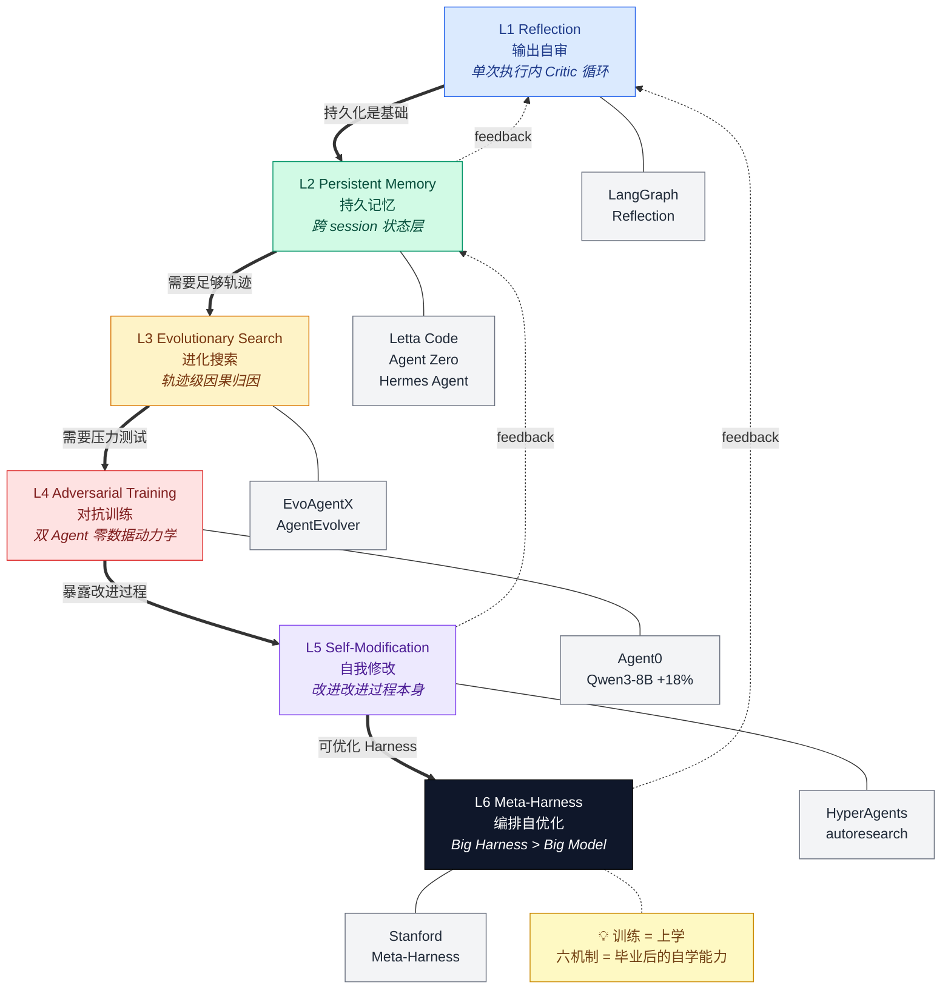

---

title: "Agent 自我改进的六条路"
created: "2026-04-28"
updated: 2026-09-07
type: entity
tags: [agent, self-improvement, reflection, memory, evolution, adversarial-training, self-modification, harness, meta-harness, visualization, codex, openai, production-case, eval-loop, tax-ai, symphony, recursive-self-improvement]
sources: [raw/articles/agent-self-improvement-six-mechanisms, raw/articles/xinzhiyuan-openai-tax-ai-self-improving-codex-eval-loop-20260606]
review_value: 7
review_confidence: 8
reviewed: 2026-09-07
review_verdict: keep
review_category: tech
---

## 概述
J0hn/AGI Hunt 梳理 Agent 不重新训练就能变强的六种机制：输出自审、持久记忆、进化搜索、对抗训练、自我修改、编排自优化。核心命题：AI 学习正从训练阶段溢出到部署阶段——权重冻结下通过外部状态层积累知识是毕业后的自学能力。   ^[raw/articles/agent-self-improvement-six-mechanisms.md]

## 可视化

### 架构图（Excalidraw / 推荐使用 ✨）

**打开方式**：将 `agent-self-improvement-six-mechanisms.excalidraw` 拖到 [excalidraw.com](https://excalidraw.com) 即可在浏览器中编辑，或在 Obsidian 中直接渲染（需安装 Excalidraw 插件）。 ^[raw/articles/agent-self-improvement-six-mechanisms.md]

Shareable link: https://excalidraw.com/#json=V1TZR8SVycPL0VJvBiYhU,bLOKZsFPtzVew1TG82VleA ^[raw/articles/agent-self-improvement-six-mechanisms.md]

文件位置：`assets/entities/agent-self-improvement-six-mechanisms.excalidraw` ^[raw/articles/agent-self-improvement-six-mechanisms.md]

> 手绘风格（Virgil 字体）+ 完美文字渲染 + 可编辑。这是本实体的主推荐可视化——比 AI 生成图更清晰，比 Mermaid 更直观。

### 架构图（Mermaid / 知识源 / 可嵌入）

### 封面图（AI 生成 / 装饰参考，仅供参考）

^[raw/articles/agent-self-improvement-six-mechanisms.md]

> Agnes image-2.0-flash 生成的 1536×1024 封面。文字可能有拼写错误（典型的 AI 图像模型问题），**仅作视觉参考，请以上方 Excalidraw / Mermaid 图为准**。

### 三种可视化对比

| 格式 | 文字准确性 | 可编辑 | 风格 | 推荐场景 |
|------|----------|--------|------|----------|
| **Excalidraw** | ✓ 完美 | ✓ 浏览器/插件可改 | 手绘 (Virgil) | ✨ 首选：演示、分享、嵌入 |
| **Mermaid** | ✓ 完美 | ✓ 修改 .md 即可 | 干净矢量 | 代码嵌入、文本搜索、版本控制 |
| **AI 图像** | ✗ 常拼错 | ✗ 像素锁定 | 手绘 (AI 模拟) | 装饰、封面、社交分享卡 |

### 如何读架构图

1. 自下而上：每一层是上一层的「基础设施」——没有持久记忆（L2），进化搜索（L3）就找不到可分析的轨迹
2. 自上而下：每一层是下一层的「元升级」——自我修改（L5）能反过来优化 L2 的记忆策略
3. 主流项目都同时使用多层机制（Hermes = L1 + L2 + L3 的组合）
4. 选型建议：从 L1 开始，L2 是必经节点，L5/L6 是研究前沿

## 六种机制详解
### 1. 输出自审（Reflection）
- **代表**：LangGraph Reflection
- **结构**：双 Agent 循环（Generator → Critic → 修改建议 → 循环）
- **终止条件**：`Critic 不返回消息 = 通过`，无需额外阈值
- **硬限制**：只发生在单次执行内，无跨 session 学习

### 2. 持久记忆
三种路径：

- **Letta Code**：API 层持久化，记忆绑定在 Agent 而非 LLM 上
- **Agent Zero**：动态工具生成 + 记忆，小模型驱动
- **Hermes Agent**（最完整）：自动技能提炼 + 定期回顾 nudging
**共同洞见**：不改权重，改状态。在 LLM 参数冻结下通过外部持久化状态层积累知识。 ^[raw/articles/agent-self-improvement-six-mechanisms.md]

### 3. 进化搜索
- **EvoAgentX**：三条优化线并行（Prompt/拓扑/配置），HotPotQA +7.44%，MATH +10%
- **AgentEvolver**（阿里巴巴）：ADCA-GRPO 算法做轨迹级因果信用分配，7B 模型 AppWorld 1.8% → 32.4%

### 4. 对抗训练
- **Agent0**（北卡+Salesforce）：零数据双 Agent 对抗，Qwen3-8B 数学推理 +18%，零标注胜过有标注

### 5. 自我修改
- **HyperAgents**（Meta）：Meta Agent 能改 Task Agent，也能改自己；跨领域迁移 imp@50 达 0.630（学通用改进策略，非领域技巧）
- **autoresearch**（Karpathy）：自动化实验但 Agent 本身不变——自动化 ≠ 自我改进

### 6. 编排自优化
- **Meta-Harness**（斯坦福）：Claude Code + Opus 4.6 迭代优化 Harness，文本分类比 ACE 高 7.7 个百分点
- **关键发现**：给完整文件系统（50%）vs 只给摘要（34%），消融证明摘要丢掉关键决策线索
- **两层天花板**：Big Model 决定理论上限，Big Harness 决定实际达到的高度

## 与现有 Wiki 的关联
与 [[entities/hermes-agent-deep-dive]] 互补：Hermes Agent 的 Skill 提炼和 nudging 在本文有更系统化的分类定位。 ^[raw/articles/agent-self-improvement-six-mechanisms.md]
与 [[concepts/hermes-agent]] 互补：self-evolution 主题的完整六条路归类，ADCA-GRPO/HyperAgents/Meta-Harness 是新维度。 ^[raw/articles/agent-self-improvement-six-mechanisms.md]
与 [[concepts/harness-engineering-framework]] 互补：第六条"编排自优化"是 Harness 工程化的最新前沿（Stanford Meta-Harness）。 ^[raw/articles/agent-self-improvement-six-mechanisms.md]
与 [[entities/agent-engineering-principles-architecture-practice]] 互补：后者 Harness 比模型关键 → 前者第六条机制具体展示如何自动化 Harness。 ^[raw/articles/agent-self-improvement-six-mechanisms.md]

## 核心命题
> AI 的学习正在从训练阶段溢出到部署阶段。过去十年模型变强的唯一方式是改权重，这些项目展示了另一种可能：**权重冻结下通过外部记忆、行为搜索、对抗训练、代码自修改、编排自优化来持续积累能力。**
训练 = 上学，这些机制 = 毕业后的**自学能力**。^[raw/articles/xinzhiyuan-openai-tax-ai-self-improving-codex-eval-loop-20260606.md]

## 相关实体
- [[entities/foundation-capital-agent-era-six-insights|foundation capital agent era six insights]]
- [[entities/hermes-agent-self-evolving|Hermes Agent 自进化机制源码解析]]
- [[entities/memento-skills-agent-self-evolving|Memento-Skills — 技能外部记忆让 Agent 自进化（arXiv 2603.18743）]]
- [[entities/ai-coding-agent-memory-system|AI Coding Agent 记忆系统]]
- [[entities/martin-fowler-ai-rd-harness-nondeterminism|Martin Fowler AI 研发 Harness：非确定性承重层]]
- [[entities/agent-reliability-context-drift-tool-hallucination|Agent Reliability: Context Drift & Tool Calling Hallucination]]
- [[entities/harness-engineering-long-term-agent-tasks|Harness Engineering：让 Coding Agent 可靠完成长程任务]]
- [[entities/harness-engineering-让-coding-agent-可靠完成长程任务-v2|Harness Engineering: 让 Coding Agent 可靠完成长程任务]]
- [[concepts/karpathy-llm-wiki-v2|Karpathy LLM Wiki V2]]
- [[entities/llm-wiki-obsidian-wiki-gbrain-self-organization-self-evolution|深度解析LLM Wiki / Obsidian-Wiki / GBrain：Agent时代知识的"自组织"与"自进化"]]
- [[entities/long-running-agent-ralph-loop-handover-harness-ruofei|长周期 Agent 详解：从 Ralph Loop 到可接管 Harness]]
- [[entities/hermes-agent-self-evolving-source-analysis|hermes-agent-self-evolving-source-analysis]]
- [[queries/harness-peer-review-framework|Harness Design Peer Review Framework]]
- [[entities/agent-memory-architecture-ruofei|Agent Memory 架构解析]]
- [[entities/claude-code-harness-deep-understanding|深入理解 Claude Code 源码中的 Agent Harness 构建之道]]
- [[entities/claude-code-20000-char-source-analysis|两万字详解Claude Code源码核心机制]]
- [[entities/agent-harness-architecture|Agent Harness 架构]]
- [[entities/karpathy-vibe-coding-agentic-engineering-v4|Karpathy 最新访谈：从 Vibe Coding 到 Agentic Engineering]]
- [[entities/openclaw-prompt-context-harness|深度解析 OpenClaw 在 Prompt / Context / Harness 三个维度中的设计哲学与实践]]
- [[queries/agent-memory-system-design|Agent Memory System 设计指南]]
- [[entities/enterprise-ai-memory-substrate-three-layer-architecture|企业级AI记忆基质三层架构：事实/交互/行动记忆]]
- [[entities/gbrain|GBrain]]
- [[entities/boris-cherny-新访谈开发工具正在从-ide-变成-agent-控制台-v2|Boris Cherny 新访谈：开发工具正在从 IDE 变成 Agent 控制台]]
- [[entities/skillclaw|SkillClaw]]
- [[entities/hermes-skill-system-winty|Skill 系统：Agent 如何把经验沉淀成可复用能力]]
- [[entities/openhuman-ai-agent-memory-tree-tokenjuice|OpenHuman: AI Agent 持久记忆框架]]
- [[entities/harness-production-agent-engineering-deficit|Harness如何支撑Agent在生产环境稳定运行？]]
- [[entities/agent-architecture-harness-new-backend|Agent架构关键变化：Harness正在成为新后端]]
- [[entities/context-engineering-three-memory-paradigms-comparison|上下文工程 - 三种Memory方案对比]]
- [[entities/ai-agent-engineer-capability-map|AI Agent 工程师能力地图]]

- [[entities/chatgpt-dreaming-v3-long-term-memory-xinzhiyuan]]
- [[entities/chatgpt-dreaming-v3-long-term-memory-openai]]
- [[entities/llm-self-improvement-system-survey-zesearch-nlp-2026|llm 自我提升系统综述 — yang 等 113 页四阶段闭环框架（zesearch nlp lab）]]
- [[entities/recursive-automated-ai-research-first-steps-2026|recursive first steps toward automated ai research：sota 三基准自]]

- [[moc/agent-engineering-guide|MOC]]
## 深度分析
### 六条路的层次结构
六种机制并非在同一平面竞争，而是在**认知层次**上层层递进：^[raw/articles/agent-self-improvement-six-mechanisms.md]

**L1 反应层**（输出自审）：单次执行内的反思修正，无持久化。Critic 循环通过「无话说 = 通过」实现自洽，但知识不过夜。 ^[raw/articles/agent-self-improvement-six-mechanisms.md]
**L2 记忆层**（持久记忆）：跨越 session 积累知识。Letta Code 绑定在 Agent 层，Hermes Agent 的 Skill 提炼实现了「用中改」——知识在复用中被修正。核心突破：**不改权重，改状态**——LLM 参数冻结下通过外部持久化层积累能力。 ^[raw/articles/agent-self-improvement-six-mechanisms.md]
**L3 搜索层**（进化搜索）：从经验中搜索更好的配置。EvoAgentX 的三条优化线和 AgentEvolver 的 ADCA-GRPO 实现了**轨迹级因果归因**——不是给整条轨迹打分，而是分析每一步的因果贡献。这解决了传统 RL 的信用分配难题。 ^[raw/articles/agent-self-improvement-six-mechanisms.md]
**L4 生成层**（对抗训练）：不再依赖外部数据或 reward model。Agent0 的双 Agent 对抗动力学——Executor 变强 → Curriculum Agent 被迫加难度——产生了自我驱动的课程。零标注胜过有标注，证明**精心策划的对抗压力比精心标注的数据更能激发潜力**。 ^[raw/articles/agent-self-improvement-six-mechanisms.md]
**L5 反思层**（自我修改）：HyperAgents 突破了「改进工具」和「改进结果」的区别，实现了**改进过程本身的改进**。最惊人的是它自己发明了持久化记忆和性能追踪机制——没有人预设，Agent 判断需要就自己加。这是真正的元认知萌芽。 ^[raw/articles/agent-self-improvement-six-mechanisms.md]
**L6 系统层**（编排自优化）：Meta-Harness 揭示了 Big Model（理论上限）和 Big Harness（实际达到的高度）的两层天花板。消融实验证明：给完整文件系统（50%）vs 只给摘要（34%），摘要丢掉的不只是边角细节，而是**做正确决策的关键决策线索**。 ^[raw/articles/agent-self-improvement-six-mechanisms.md]

### 机制间的协同效应
六种机制并非互斥：主流项目都是组合使用。Hermes Agent 同时用了反思、记忆和技能进化；AgentEvolver 混合了对抗生成变体和进化搜索；Meta-Harness 的内部循环本身也包含反思和进化。这不是偶然——**越高阶的机制越需要低阶机制作为基础设施**。 ^[raw/articles/agent-self-improvement-six-mechanisms.md]

### 自我修改的本质：HyperAgents 的突破
autoresearch vs HyperAgents 的本质区别：autoresearch 改进的是**实验结果**，HyperAgents 改进的是**改进过程本身**。DGM-H 跨领域迁移 imp@50 达 0.630，而原版 DGM 约等于 0——差别在于前者学到的是通用的「如何改进」策略（持久化记忆、趋势分析），后者学到的是领域特定技巧。这指向一个核心洞见：**最可迁移的能力是「改进能力」本身**。 ^[raw/articles/agent-self-improvement-six-mechanisms.md]

### 两层天花板的工程意义
Meta-Harness 提出的 Big Model / Big Harness 框架有直接的工程含义：模型能力是分子，Harness 质量是分母。业界普遍高估分子（不断换模型），低估分母（不愿意在 Harness 工程上投入）。Meta-Harness 用 7 轮迭代把文本分类推到比 ACE 高 7.7 个百分点，context 用量只有 1/4——这是 Harness 工程的胜利。 ^[raw/articles/agent-self-improvement-six-mechanisms.md]

## 实践启示
### 选型建议
**从 L1 开始**，不要一上来就做 L5。输出自审最容易实现（Critic 循环），持久记忆其次，进化搜索需要足够的数据积累，对抗训练需要精心的动力学设计，自我修改目前只有 Meta 的研究验证。 ^[raw/articles/agent-self-improvement-six-mechanisms.md]
**持久记忆是必经节点**。无论最终选择哪条路，持久记忆都是构建真正 Agent 的基础设施——它解决了知识不过夜的问题。没有持久记忆，所有「学习」都只是当次执行内的优化。 ^[raw/articles/agent-self-improvement-six-mechanisms.md]
**Harness 工程被严重低估**。Meta-Harness 的消融实验应该成为所有 Agent 开发者的警醒：给 AI 完整信息（50%）vs 摘要（34%），差距远比模型切换（Claude 3.5 → 4）带来的收益大。 ^[raw/articles/agent-self-improvement-six-mechanisms.md]

### 实现优先级
1. **立即可做**：给 Agent 加持久记忆层（参考 Hermes Agent 的 Skill 提炼 + nudging）
2. **短期可做**：引入 Critic 循环实现输出自审，用 Pyright/ESLint 等工具做代码级验证
3. **中期可做**：如果有多 Agent 场景，引入对抗训练动力学（Agent0 范式）
4. **长期关注**：HyperAgents 的自我修改范式——尤其是「系统自己发明持久化记忆」这一现象

### 避免的陷阱
- **自动化 ≠ 自我改进**（autoresearch 的教训）：能跑实验但 Agent 本身不变，是强大的自动化工具，不是自我改进
- **摘要不是替代品**：Meta-Harness 的消融明确证明，摘要会丢掉关键决策线索。给 AI 完整信息，不要高估自己的摘要能力
- **单机制不够**：实践中的系统需要多层机制协同，单独依赖任一机制都会遇到天花板

### 核心行动项

→ [[raw/articles/agent-self-improvement-six-mechanisms.md|原文存档]] ^[raw/articles/agent-self-improvement-six-mechanisms.md]
> 如果你只记住一件事：**权重冻结下的外部状态层（记忆 + 搜索 + 对抗 + 自修改）是 AI 部署后持续变强的主流范式。训练 = 上学，这些机制 = 毕业后的自学能力。现在是做 Agent Harness 工程的最佳时机——因为这层的回报率比换模型高得多。**

## 第 2 来源（2026-06 新智元）：OpenAI Tax AI 生产案例 + 三招具体化机制

新智元 2026-06 翻译解读 OpenAI 官方博客「Building Self-Improving Tax Agents with Codex」，把上面六条框架映射到 OpenAI 联合 Thrive Holdings / Crete 会计师联盟落地的一个报税 AI（Tax AI）的真实生产数据上。是同主题的**生产实证**而非平行新论。^[raw/articles/xinzhiyuan-openai-tax-ai-self-improving-codex-eval-loop-20260606.md]

### 生产数据：6 周 25%→86%，7000 份税表
- 资深会计师单季报税时间：**180 小时 → 15 小时**（节省 91.7%）
- 整个赛季处理 **7000 份税表**，最高准确率 **97%**，产能提升 **约 50%**
- **字段完成准确率：6 周前 25% → 6 周后 86%**（6 周翻 3.4 倍，曲线仍在加速）
- 渐进复杂度：6 周前只能处理 W-2/1099（最简单）→ 6 周后能处理 Schedule C、Schedule A、K-1
- 单一字段（租赁房产「公平出租天数」）从「几乎不可用」→「6 周 90% 精确率 + 90% 召回率」^[raw/articles/xinzhiyuan-openai-tax-ai-self-improving-codex-eval-loop-20260606.md]

### 三招具体化的自我改进机制（映射到六条框架）
| 招数 | 做了什么 | 映射到六条框架 | 价值点 |
|------|----------|---------------|--------|
| 第 1 招 | 会计师每次纠错 → 结构化数据（AI 预测 / 改成 / 最终用） | **L2 持久记忆 + L3 进化搜索的中间桥梁**：纠错即训练样本 | 把人的反馈变成可学习的样本 |
| 第 2 招 | 全链路 trace（OCR → 提取 → 引用 → 映射 → 纠正 → 报税） | **Meta-Harness 揭示的「给完整信息 50% vs 摘要 34%」的工程化**：留痕即决策线索 | 错误可定位到具体节点（OCR 错 / 映射 gap / 表格不支持） |
| 第 3 招 | 用 Codex 把反复出现的错误 pattern 打包成"有明确成功标准"的工程任务 → Codex 自我定位 → 写修复 → 跑 targeted eval → 跑回归 → 生成 PR | **L5 自我修改 + L6 编排自优化**：Codex 即 Meta-Harness 的 production 版 | 模糊证据时路由回产品团队（避免幻觉塞进流程） |

**关键洞见**：三招都不是新概念（六条框架里都有），但**组合方式**是 OpenAI 第一次公开的"在生产环境跑通"的范例——前两招把数据 + 决策线索沉淀下来（基础设施层），第三招把 Codex 接到这条流水线上（执行层）。这就是 Meta-Harness 论文里说"Big Model 决定上限，Big Harness 决定实际达到高度"在生产中的具象化。^[raw/articles/xinzhiyuan-openai-tax-ai-self-improving-codex-eval-loop-20260606.md]

### 上下文：OpenAI 2026 上半年的自我改进暗线
- **2 月**：GPT-5.3-Codex 参与自身构建（OpenAI 官方原话："我们第一个在创造自身过程中发挥了关键作用的模型"）— 模型层
- **4 月**：开源 Symphony（Codex + Linear 编排层），单工程师可并行 3-5 个 Codex 会话，部分团队产出翻倍 — 工程层
- **4 月**：ICLR 2026 在里约办「AI 递归自我改进」workshop — 学术层
- **5 月**：MOSS 论文（arXiv 2605.22794），在 OpenClaw 平台上让 Agent 改写自己源码，4 任务平均 0.25 → 0.61 — 源码层

**新智元编辑的判断**：「模型智能是起点，系统智能才是终局」——OpenAI 用 Codex 驱动的 eval 闭环让 Agent 在生产中自己修 bug，Anthropic 用 Memory Files + Dreams 让 Agent 在会话间自己整理经验，**方法不同，赌的是同一件事——Agent 能不能从一次性工具变成越用越强的系统**。^[raw/articles/xinzhiyuan-openai-tax-ai-self-improving-codex-eval-loop-20260606.md]

### 商业信号：Thrive Holdings 拿全部 IP
Tax AI 的全部知识产权归 **Thrive Holdings**（Joshua Kushner 创办，OpenAI 最大投资方之一），OpenAI 派了 6 个月工程师、给模型、给深度集成，**最后连 IP 都没留**——在硅谷大厂 AI 合作里极其罕见。 ^[raw/articles/agent-self-improvement-six-mechanisms.md]
- **OpenAI 图的不是报税产品 IP，而是「可复制的自我改进方法论」**——一个生产验证的飞轮范式
- Thrive Holdings 已经在把同样闭环复制到 **记账、审计、IT 运维**
- 这与 [[entities/foundation-capital-agent-era-six-insights|Foundation Capital agent era]] 中"infra 厂商抢应用层 IP"的趋势一致，**但 OpenAI 反向操作：放弃应用层 IP 换生产方法论**——是更上游的卡位

### 与现有六条框架的对应与扩展
| OpenAI 元素 | 对应六条框架 | 本文新增洞见 |
|-------------|--------------|--------------|
| GPT-5.3-Codex 参与自身构建 | **L5 自我修改** | 模型权重未动，Codex 用早期版本调自己的训练流程——是**自我修改的训练基础设施**而非模型本身 |
| Symphony 编排层 | **L6 编排自优化** | 把"管 3-5 个 Agent 的工程师注意力"作为新瓶颈的命名（**人类注意力 = Agent 产能的天花板**） |
| Tax AI 三招 | **L2 记忆 + L3 搜索 + L5/L6 编排** | 第一次把六条框架的**生产落地路径**完整跑通——前两招建基础设施，第三招连 Codex 闭环 |
| MOSS 源码级自改写 | **L5 自我修改**（极端形态） | 突破"改 prompt/workflow"边界，直接改 Agent 自己的代码——是 L5 的**源码实现** |
| Conway / Memory Files / Dreams | **L2 持久记忆 + 异步整合** | Anthropic 路线：用文件系统 + 异步梦境做 Agent 永久大脑 |

**6 个机制 → 11 个具体项目/案例映射**。新智元文章的最大价值不是新机制，而是**给六条框架的每个 L 都举出 2026 年的生产案例 + 量化数据**——这是六条框架从「理论分类」到「生产验证」的关键一步。^[raw/articles/xinzhiyuan-openai-tax-ai-self-improving-codex-eval-loop-20260606.md]

### 实践启示：从框架到生产
- **L2+L3+L5+L6 的"基础设施三件套"是落地前提**：先建记忆层（纠错即样本）、再建决策线索层（全链路 trace）、最后接 Codex 闭环——顺序不能颠倒
- **模糊证据路由回产品团队**是抗幻觉的关键设计：Codex 不是万能的，不知道就是不知道，硬塞流程会污染训练集
- **3-5 个 Agent 的工程师注意力上限**是工程现实——Symphony 的"管工作不管 Agent"思路值得借鉴
- **6 周 25%→86% 的曲线**证明：自我改进不是匀速，而是**指数加速**（更复杂的问题被解决 → 每份省下的人工时间越多 → 反哺训练 → 处理更复杂的问题）
- **生产方法论 > 应用层 IP**：OpenAI 放弃 Tax AI IP 换范式，是把"自我改进工程"作为下一代护城河，与 [[entities/harness-engineering-long-term-agent-tasks|Harness Engineering 长程任务]] 中"Big Harness > Big Model"的判断完全一致

→ [[raw/articles/xinzhiyuan-openai-tax-ai-self-improving-codex-eval-loop-20260606.md|第 2 原文存档]] ^[raw/articles/agent-self-improvement-six-mechanisms.md]