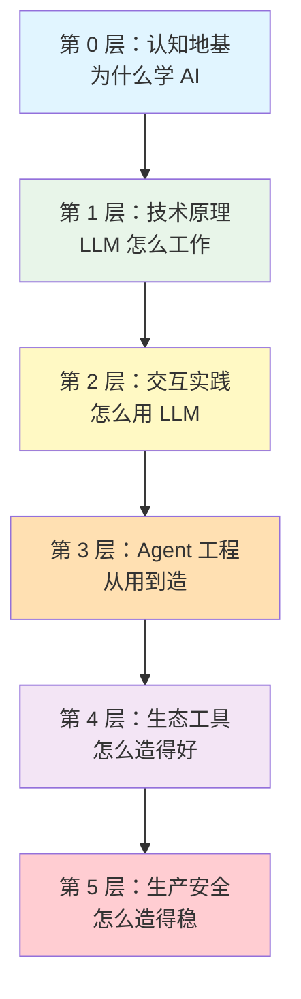

# 庖丁解牛式 AI 知识体系学习路径

> 把整个 wiki 按**知识依赖深度**分层，由浅入深、层层递进。
> 配合 7 种学习法，让新手从「为什么学 AI」一路走到「怎么造得稳」。

---

## 这是什么

一条贯穿你 7000 页知识库的**主干学习路径**——5 层 24 章，约 20 小时。

不是百科全书式堆砌，而是顺着知识的内在依赖链编排：
**不懂 Transformer → 看不懂 Prompt → 看不懂 Agent → 看不懂 Harness → 看不懂生产安全。**

每章都建立在前一章之上，每层都建立在前一层之上。

---

## 5 层结构总览

| 层 | 主题 | 章数 | 用时 | 目标 |
|---|---|---|---|---|
| [第 0 层](layer-0-foundation.md) | 认知地基 | 3 | 1.5h | 建立动机 |
| [第 1 层](layer-1-llm-principles.md) | LLM 原理 | 5 | 4h | 理解底层 |
| [第 2 层](layer-2-interaction.md) | 交互实践 | 4 | 3.5h | 学会使用 |
| [第 3 层](layer-3-agent-engineering.md) | Agent 工程 | 4 | 3.5h | 从用到造 |
| [第 4 层](layer-4-ecosystem.md) | 生态工具 | 4 | 3.5h | 工程化 |
| [第 5 层](layer-5-production-security.md) | 生产安全 | 4 | 3.5h | 落地防御 |

---

## 学习法融入

| 学习法 | 怎么用 | 在哪里 |
|---|---|---|
| **费曼学习法** | 每章末尾「教给 12 岁孩子」练习 | 每章「🧠 费曼练习」 |
| **番茄钟** | 每章切 25 分钟块 | 每章开头「🍅 番茄钟规划」 |
| **间隔重复** | 第 N 章开头回顾第 N-3、N-7 章 | 每章「📋 前置回顾」 |
| **主动回忆** | 5 道题，答案折叠先答再看 | 每章「✅ 复习题」 |
| **交错练习** | 每层末尾关卡混合多章 | 每层 MOC「🚪 关卡」 |
| **细化难度** | 场景题为主非定义题 | 复习题第 3 题 |
| **双编码** | 关键概念配 Mermaid 图 | 章节内嵌流程图 |

---

## 怎么用这条路径

### 如果你是新手
1. 从第 0 层开始，**不要跳层**
2. 每章按「🍅 番茄钟规划」走，别贪快
3. 认真做「🧠 费曼练习」——写下来，别只在脑子里想
4. 复习题**先答再展开答案**
5. 每层末尾过「🚪 关卡」再进下一层

### 如果你已有基础
- 看每章「🎯 重点回顾」判断是否需要细读
- 直接跳到你不熟的层
- 关卡题当作 self-test

### 配套
- 准备一个番茄钟 App 或实体计时器
- 准备一个笔记文件存费曼练习（`concepts/learning/notes/`）
- 每周日花 30 分钟回看本周的费曼笔记

---

## 全部章节

### 第 0 层：认知地基
1. [AI 浪潮：为什么是现在](../concepts/learning/chap-01-ai-wave.md) — 25min
2. [软件的下一个范式](../concepts/learning/chap-02-software-paradigm.md) — 50min
3. [知识管理的新形态](../concepts/learning/chap-03-knowledge-management.md) — 25min
→ [第 0 层全库索引](layer-0-foundation.md)

### 第 1 层：技术原理
4. [Transformer 架构](../concepts/learning/chap-04-transformer.md) — 50min
5. [Token 与上下文窗口](../concepts/learning/chap-05-token-context.md) — 50min
6. [训练三阶段](../concepts/learning/chap-06-training-stages.md) — 75min
7. [Scaling Law](../concepts/learning/chap-07-scaling-laws.md) — 25min
8. [推理优化](../concepts/learning/chap-08-inference-optimization.md) — 50min
→ [第 1 层全库索引](layer-1-llm-principles.md)

### 第 2 层：交互实践
9. [Prompt 工程基础](../concepts/learning/chap-09-prompt-fundamentals.md) — 25min
10. [Prompt 模式](../concepts/learning/chap-10-prompt-patterns.md) — 50min
11. [上下文工程](../concepts/learning/chap-11-context-engineering.md) — 50min
12. [RAG 检索增强](../concepts/learning/chap-12-rag.md) — 75min
→ [第 2 层全库索引](layer-2-interaction.md)

### 第 3 层：Agent 工程
13. [从对话到 Agent](../concepts/learning/chap-13-from-chat-to-agent.md) — 50min
14. [Agent 记忆架构](../concepts/learning/chap-14-agent-memory.md) — 75min
15. [规划与推理](../concepts/learning/chap-15-planning-reasoning.md) — 50min
16. [工具使用与 MCP](../concepts/learning/chap-16-tools-mcp.md) — 50min
→ [第 3 层全库索引](layer-3-agent-engineering.md)

### 第 4 层：生态工具
17. [Harness 工程框架](../concepts/learning/chap-17-harness-framework.md) — 75min
18. [多 Agent 协作](../concepts/learning/chap-18-multi-agent.md) — 50min
19. [开源生态](../concepts/learning/chap-19-open-source-ecosystem.md) — 50min
20. [评测与基准](../concepts/learning/chap-20-evaluation-benchmarks.md) — 50min
→ [第 4 层全库索引](layer-4-ecosystem.md)

### 第 5 层：生产安全
21. [生产级 Agent](../concepts/learning/chap-21-production-agent.md) — 50min
22. [可观测性](../concepts/learning/chap-22-observability.md) — 50min
23. [安全威胁与防御](../concepts/learning/chap-23-security-defense.md) — 75min
24. [治理与红线](../concepts/learning/chap-24-governance.md) — 50min
→ [第 5 层全库索引](layer-5-production-security.md)

---

## 设计依据

完整方案见 [learning-path-blueprint](../concepts/learning/learning-path-blueprint.md)。

**✅ 全部 24 章已交付**，配合 7 种学习法（费曼/番茄钟/间隔重复/主动回忆/交错练习/细化难度/双编码）。

> 庖丁解牛，始于见全牛，终于游刃有余。24 章给你见全牛的地图，真正的游刃有余要在实践中练。
## 相关链接

- [[concepts/learning/learning-path-blueprint|学习路径蓝图]]
- [[queries/wiki-quality-dashboard|Wiki 质量仪表盘]]
