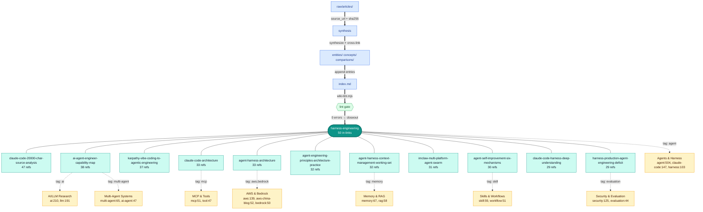

# Wiki Entities 目录的整体架构图

## 问题

`[canonical wiki 路径已隐藏]` 目录已经从早期几十篇扩展到 1683 个 .md 文件（17 MB）。从结构层面把握"这个知识库到底装了什么"越来越难——单凭文件名和 tag 列表，无法快速回答"哪些是核心节点、哪些是边缘节点、哪些集群之间存在交叉引用"。

本 Query 给出**一张可编辑的 Mermaid 架构图**，覆盖三件事：

1. 引用频次最高的 12 个实体节点（`harness-engineering` 为中心，11 个卫星）
2. 8 个按 tag 频次聚合的 topic cluster
3. 知识库底层的 5 步入库流水线（从 `raw/articles/` 到 `index.md` + lint gate）

## 数据来源

数据基于对 `[canonical wiki 路径已隐藏]` 的实际扫描（2026-06-02）：

- **入链次数**：扫描所有 entity 文件的 `[entities/<slug>]` 形式反向引用，得出 top-12（见架构图中央星型）
- **Tag 频次**：YAML frontmatter `tags:` 字段聚合（`agent: 504`, `llm: 191`, `aws: 139`, `claude-code: 147`, `harness: 103` 等）
- **文件大小**：top-20 实体都 ≥ 29 KB，其中最大的 `multi-agent-trading-system-deep-thinking.md` 45.8 KB

完整数据（top-30 tags + top-20 by size）见文末附录。

## 架构图

## 图例

| 元素 | 含义 |
|------|------|
| 中心青绿六边形 | `harness-engineering`（50 个入链，全 wiki 引用最高） |
| 11 个浅青卫星 | top-12 中除 hub 外的 11 个高引用实体 |
| 8 个黄色圆角矩形 | 按 tag 频次聚合的 topic cluster |
| 蓝色流水线节点 | 5 步入库流程（Phase 2 路径） |
| 绿色门形节点 | lint gate（必须 0 errors 才能 closeout） |
| 实线 | 直接入链引用 / 流水线流向 |
| 虚线 | tag 共现关联（cluster 是聚合视图） |

## 如何读这张图

1. **从中心向外看**：`harness-engineering` 是知识库的事实中心——所有 11 个高引用实体都和它直接相关。这意味着整个 wiki 的语义重心是 "如何为 LLM agent 搭建 harness"，与 AGENTS.md 中 "AI/ML research wiki" 的定位一致。
2. **从 cluster 看覆盖度**：`Agents & Harness`（C1）的 tag 频次（504+147+103=754）压倒性领先，说明 wiki 严重偏向 agent 实践而非 AI 基础研究。如果未来想补"基础模型架构"或"训练方法论"方向，C2 cluster 是值得扩充的洼地。
3. **从流水线看完整度**：5 步流程代表一次成功的 Phase 2 摄入。`lint gate` 是唯一硬性门控——任何 0 错误的失败都必须修复后重跑，不能跳过。

## 配套的视觉封面图

`assets/wiki-entities-architecture.png` 是用 Agnes Image 2.0 Flash 生成的同主题 AI 图像。**注意**：AI 图像模型渲染小文字不可靠，部分节点标签可能出现拼写错误（`Atlsse and Hedrorct` / `entiriss/concepts/...` 等）。所有需要正确标签的场景，请使用上方 Mermaid 图。

## 编辑建议

修改这张图时直接编辑本文档的 `mermaid` 代码块即可。常用修改：

- **新增 satellite**：在 top-N 列表加一行，复制一个 `Sxx["name N refs"]` 节点 + `HUB --- Sxx` 边
- **新增 cluster**：在 `tags` 频次扫描后加一个 `Cy["name tag1:N, tag2:N"]` 节点和 `.->` 虚线
- **调整样式**：修改 `classDef` 块中的颜色——目前 hub 用 teal、cluster 用 amber、pipeline 用 blue、gate 用 green

## 附录：完整数据

### Top-30 tags across entities（2026-06-02 实测）

| Tag | Count | Cluster |
|-----|-------|---------|
| agent | 504 | C1 |
| ai | 210 | C2 |
| llm | 191 | C2 |
| claude-code | 147 | C1 |
| aws | 139 | C3 |
| newsletter | 133 | — |
| security | 125 | C7 |
| anthropic | 125 | C1 |
| architecture | 121 | C1 |
| harness | 103 | C1 |
| claude | 94 | C1 |
| engineering | 88 | — |
| wechat | 72 | — |
| article | 70 | — |
| memory | 67 | C5 |
| multi-agent | 65 | C4 |
| openai | 63 | — |
| openclaw | 63 | C1 |
| skill | 59 | C8 |
| rag | 58 | C5 |
| harness-engineering | 55 | C1 |
| aws-china-blog | 52 | C3 |
| workflow | 51 | C8 |
| mcp | 51 | C6 |
| open-source | 51 | — |
| bedrock | 50 | C3 |
| model | 49 | C2 |
| ai-agent | 47 | C4 |
| tool | 47 | C6 |
| evaluation | 44 | C7 |

### Top-12 inbound references (whole wiki → entities/)

| Rank | In-links | Entity |
|------|----------|--------|
| 1 | 50 | harness-engineering |
| 2 | 47 | claude-code-20000-char-source-analysis |
| 3 | 38 | ai-agent-engineer-capability-map |
| 4 | 37 | karpathy-vibe-coding-to-agentic-engineering |
| 5 | 33 | claude-code-architecture |
| 5 | 33 | agent-harness-architecture |
| 7 | 32 | agent-engineering-principles-architecture-practice |
| 7 | 32 | agent-harness-context-management-working-set |
| 9 | 31 | imclaw通过微信飞书操控claude-code-coodex-gemini-clipi-agent蜂群 |
| 10 | 30 | agent-self-improvement-six-mechanisms |
| 11 | 29 | claude-code-harness-deep-understanding |
| 11 | 29 | harness-production-agent-engineering-deficit |

### Top-5 entities by file size

| Size | Entity |
|------|--------|
| 45.8 KB | multi-agent-trading-system-deep-thinking |
| 38.3 KB | mythos-finds-a-curl-vulnerability |
| 37.0 KB | aws-bedrock-multi-agent-collaboration-guide |
| 36.5 KB | ai-agent-exploration-legacy-developer |
| 36.4 KB | 十年老技术开发的-ai-agent-探索之路 |

## 数据快照

- Total entity files: 1683
- Total size: 17 MB
- Inbound entity→entity references: 4735
- Files parsed for frontmatter: 1674 / 1683 (9 files have non-standard frontmatter)
- Snapshot date: 2026-06-02
